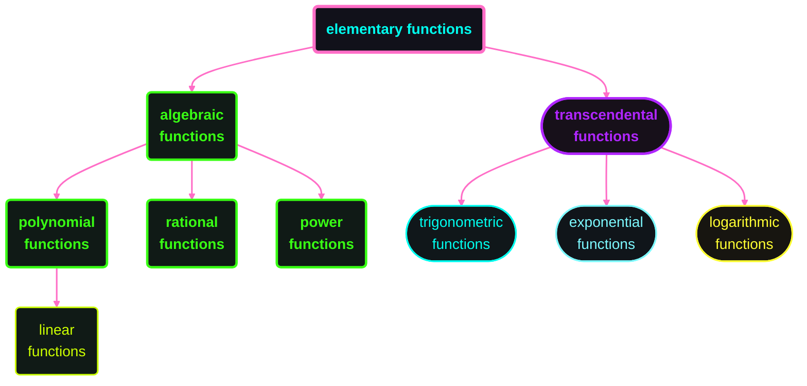

# Table of Contents

1. [[#一些基本概念]]
    1. [[#數]]
    2. [[#座標系]]
    3. [[#集合]]
    4. [[#區間]]
    5. [[#不等式]]
    6. [[#絕對值]]
    7. [[#平面幾何]]
2. [[#函數]]
3. [[#函數運算]]
4. [[#函數圖形]]
5. [[#常見之函數類型]]
6. [[#函數特性]]
7. [[#反函數]]
8. [[#指數函數]]
9. [[#對數函數]]
10. [[#三角函數]]
11. [[#反三角函數]]

---

# 一些基本概念

## 數

### 數系 (number systems)

| 數系     | 美語             | 符號          | 含義                                     |
| -------- | ---------------- | ------------- | ---------------------------------------- |
| 自然數系 | natural numbers  | $\mathbb {N}$ | 所有正整數                               |
| 整數系   | integers         | $\mathbb {Z}$ | 正整數、零、負整數                       |
| 有理數   | rational numbers | $\mathbb {Q}$ | 可表示為分數的數                         |
| 實數系   | real numbers     | $\mathbb {R}$ | 數線上所有的點的集合，包括有理數與無理數 |
| 複數系   | complex numbers  | $\mathbb {C}$ | 形如 $a+bi$ 的數                         |

### 存在量詞 (quantifiers)

| 存在量詞 | 美語            | 符號       | 含義               |
| -------- | --------------- | ---------- | ------------------ |
| 對所有   | for all         | $\forall$  | 所有都滿足，無意外 |
| 存在     | there exists    | $\exists$  | 只需有一個滿足     |
| 存在唯一 | there is unique | $\exists!$ | 只存在一個滿足     |

### 練習

1. $x^4-3x^2+2=0$

    > [!note] my answer
    > $$
    >   \begin{aligned}
    >       x^4-3x^2+2&=0\\
    >       (x^2-1)(x^2-2)&=0\\
    >       (x-1)(x+1)(x^2-2)&=0\\
    >       x=
    >       \begin{cases}
    >           1\\
    >           -1\\
    >           \sqrt{2}\\
    >           -\sqrt{2}
    >       \end{cases}
    >   \end{aligned}
    > $$

    > [!check] correct

2. $\frac{2x}{x+1}=\frac{2x-1}{x}$

    > [!note] my answer
    > $$
    >   \begin{aligned}
    >       \frac{2x}{x+1}&=\frac{2x-1}{x},\quad x\neq-1,x\neq0\\
    >       2x^2&=2x^2+2x-x-1\\
    >       x&=1
    >   \end{aligned}
    > $$

    > [!check] correct

3. $2x(4-x)^{-\frac{1}{2}}-3\sqrt{4-x}=0$


## 座標系

## 集合

## 區間

## 不等式

## 絕對值

## 平面幾何

### 區間 (intervals)

| 區間     | 美語                  | 符號                  | 集合                         |     |
| ------ | ------------------- | ------------------- | -------------------------- | --- |
| 開區間    | open interval       | $(a, b)$            | $\{x \mid a < x < b\}$     |     |
| 閉區間    | closed interval     | $[a, b]$            | $\{x \mid a \le x \le b\}$ |     |
| 左開右閉區間 | left-open interval  | $(a, b]$            | $\{x \mid a < x \le b\}$   |     |
| 左閉右開區間 | right-open interval | $[a, b)$            | $\{x \mid a \le x < b\}$   |     |
| 無限區間   | open interval       | $(a, b)$            | $\{x \mid a < x < b\}$     |     |
|        | unbounded interval  | $(a, \infty)$       | $\{x \mid x > a\}$         |     |
|        |                     | $[a, \infty)$       | $\{x \mid x \ge b\}$       |     |
|        |                     | $(-\infty, b)$      | $\{x \mid x < b\}$         |     |
|        |                     | $(-\infty, b]$      | $\{x \mid x \le b\}$       |     |
|        |                     | $(-\infty, \infty)$ | $\mathbb R$                |     |

### 集合 (sets)

| 集合     | 美語                              | 符號                               | 含義                                                    |
| ------ | ------------------------------- | -------------------------------- | ----------------------------------------------------- |
| 聯集     | union                           | $A \cup B$                       | $\{x \mid x \in A \lor x \in B\}$                     |
| 交集     | intersection                    | $A \cap B$                       | $\{x \mid x \in A \land x \in B\}$                    |
| 子集     | subset                          | $A \subseteq B$                  | $\forall x(x \in A \implies x\in B)$                  |
| 真子集    | proper subset                   | $A \subset B$ / $A \subsetneq B$ | $A \subsetneq B \land A \neq B$                       |
| 互斥     | disjoint                        | $A \cap B=\emptyset$             | $\neg \exists x(x \in A \land x \in B)$               |
| 有限個聯集  | finite union                    | $\bigcup_{i=1}^nA_i$             | $\{x \mid \exists i \in \{1, \dots, n\}, x \in A_i\}$ |
| 有限個交集  | finite intersection             | $\bigcap_{i=1}^nA_i$             | $\{x \mid \forall i \in \{1, \dots, n\}, x \in A_i\}$ |
| 可數無窮聯集 | countable infinite union        | $\bigcup_{i=1}^\infty A_i$       | $\{x \mid \exists i \in \mathbb N, x \in A_i\}$       |
| 可數無窮交集 | countable infinite intersection | $\bigcap_{i=1}^\infty A_i$       | $\{x \mid \forall i \in \mathbb N, x \in A_i\}$       |

#### assignment 0

1. $\bigcup_{n=1}^\infty [-n, n]$

   > [!note] my answer: $\mathbb R$

   > [!success] correct

2. $\bigcap_{n=1}^\infty (0, \frac 1 n)$

   > [!note] my answer: $(0, \frac 1 \infty)$

   > [!error] answer: $\emptyset$
   > $(0, \frac 1 \infty)$ is an **invalid** notation

3. $\bigcap_{n=1}^\infty (0, \frac 1 n]$

   > [!note] my answer: $\frac 1 \infty$

   > [!error] answer: $\emptyset$
   > $\frac 1 \infty$ is also an **invalid** notation

4. $\bigcap_{n=1}^\infty [0, \frac 1 n)$

   > [!note] my answer: $0$

   > [!error] answer: $\{0\}$
   > $0$ is an **element**, and $\{0\}$ is a **set**

5. $\bigcup_{n=2}^\infty [\frac 1 n, 1 - \frac 1 n]$

   > [!note] my answer: $\{\frac 1 2\}$

   > [!error] answer: $(0, 1)$
   > $\{\frac 1 2\}$ is the answer of $\cap$ rather than $\cup$

### 不等式 (inequalities)

#### 性質 (properties)

> 令 $a\, b\, c \in \mathbb R$

1. 若 $a < b$, 則 $a\pm c<b\pm c$
2. 若 $a < b, c < d$, 則 $a+c<b+d$
3. 若 $a < b, c > 0$, 則 $ac<bc$
4. 若 $a < b, c < 0$, 則 $ac>bc$
5. 若 $0 < a < b$, 則 $\frac 1 a>\frac 1 b$

#### assignment 1

1. $2x-3<x+4\le 3x- 2$

   > [!note] my answer
   > $\begin {aligned} 2x - 3 &< x + 4\\ x &< 7\\ \\ x + 4 &\le 3x - 2\\ x &\ge 3 \\ x &\in [3, 7) \end {aligned}$

   > [!SUCCESS] correct

2. $x^3 > x$

   > [!note] my answer
   > $\begin {aligned} &\text {for } x \ne 0\\ &x^2 > 1\\ &x \in (-\infty, -1) \cup (1, \infty)\\ \\ &\text {for } x = 0\\ &x^3 \text {should } = x\\ \\ &x \in (-\infty, -1) \cup (1, \infty) \end {aligned}$

   > [!hint] shorter way
   > if $x < 0$, we should flip operator sign
   >
   > $\begin {aligned} &x(x^2 - 1) > 0\\ &x(x + 1)(x - 1) > 0\\ &x_1 = -1, \quad x_2 = 0, \quad x_3 = 1\\ &\text {for } x \in (-\infty, -1) \rightarrow < 0\\ &\text {for } x \in (-1, 0) \rightarrow > 0\\ &\text {for } x \in (0, 1) \rightarrow < 0\\ &\text {for } x \in (1, \infty) \rightarrow > 0\\ &x \in (-1, 0) \cup (1, \infty) \end {aligned}$

3. $(2 - x)(1 + x)^2x^3 \ge 0$

   > [!note] my answer
   > $\begin {aligned} &(2 - x)x^3(1 + x)^2 \ge 0\\ &\because (1 + x)^2 \ge 0\\ &\therefore 2x^3 - x^4  \ge 0\\ &2x^3 \ge x^4\\ &\text {for } x \ne 0\\ &x \le 2\\ \\ &\text {for } x = 0\\ &2x^3 = x^4\\ &x \in (-\infty, 2] \end {aligned}$

   > [!error] answer: $x \in \{-1\} \cup [0, 2]$
   > if $x = -1$, the entire equation equals `0`
   > besides, there are `0` and `2` critical points for $(2 - x)x^3$
   >
   > $\begin {aligned} &\text {for } x = -1 \rightarrow = 0\\ \\ &(2 - x)x^3 \ge 0\\ &x_1 = 0, \quad x_2 = 2\\ &\text {for } x \in (-\infty, -1) \cup (-1, 0) \rightarrow < 0\\ &\text {for } x \in [0, 2] \rightarrow \ge 0\\ &\text {for } x \in [2, \infty) \rightarrow \le 0\\ &x \in \{-1\} \cup [0, 2] \end {aligned}$

4. $-2<\frac {2x-3} {x+1}\le 1$

   > [!info] my answer
   > $\begin {aligned} &-2 < \frac {2x - 3} {x + 1}\\ &-2x -2 < 2x - 3\\ &x > \frac {1} {4}\\ \\ &\frac {2x - 3} {x + 1} \le 1\\ &2x - 3 \le x + 1\\ &x \le 4\\ &x \in (\frac {1} {4}, 4] \end {aligned}$

   > [!error] correct result but progress is wrong
   > invalid progress
   > miss $x+1<0$ senario
   >
   > $\begin {aligned} &\text {for } x + 1 > 0 \rightarrow x \in (-1, \infty)\\ &-2 < \frac {2x - 3} {x + 1} \le 1\\ &x \in (\frac {1} {4}, 4]\\ \\ &\text {for } x + 1 < 0 \rightarrow x \in (-\infty, -1)\\ &-2 > \frac {2x - 3} {x + 1} \ge 1\\ &x \in (-\infty, \frac {1} {4}) \cap [4, \infty) \rightarrow \emptyset\\ \\ &x \in (\frac {1} {4}, 4] \end {aligned}$

5. $2x^2+1>4x$

   > [!info] my answer
   > $\begin {aligned} &2x^2 - 4x + 1 > 0\\ &x_1 = 1 - \frac {\sqrt {2}} {2}, \quad x_2 = 1 + \frac {\sqrt {2}} {2}\\ &x \in (-\infty, 1 - \frac {\sqrt {2}} {2}) \cup (1 + \frac {\sqrt {2}} {2}, \infty) \end {aligned}$

   > [!success] correct

#### 絕對值不等式

1. $\lvert ab \rvert = \lvert a \rvert \lvert b \rvert$
2. $\lvert a+b \rvert \le \lvert a \rvert + \lvert b \rvert$ (**三角形任意兩邊之合大於第三邊**)
3. $\lvert a \rvert - \lvert b \rvert \le \lvert a-b \rvert$ (**三角形任意兩邊之差小於第三邊**)

##### assignment 2

1. $\lvert 3x-2 \rvert \le 1$

   > [!note] my answer
   > $\begin {aligned} &\text {for } 3x - 2 < 0 \rightarrow x < \frac 2 3\\ &-(3x - 2) \le 1\\ &x \ge \frac 1 3 \rightarrow x \in [\frac 1 3, \frac 2 3)\\ \\ &\text {for } 3x - 2 > 0 \rightarrow x > \frac 2 3\\ &3x - 2 \le 1\\ &x \le 1 \rightarrow x \in (\frac 2 3, 1]\\ \\ &\text {for } 3x - 2 = 0 \rightarrow x = \frac 2 3\\ &\lvert 3 \times \frac 2 3 - 2 \rvert = 0 \le 1\\ \\ &x \in [\frac 1 3, 1] \end {aligned}$

   > [!success] correct

2. $\lvert x+1 \rvert = \lvert x-3 \rvert$

   > [!note] my answer
   > $\begin {aligned} &\text {for } x + 1 \le 0 \land x - 3 \le 0 \rightarrow x \le -1\\ &-(x + 1) = -(x - 3) \rightarrow \emptyset\\ \\ &\text {for } x + 1 > 0 \land x - 3 \le 0 \rightarrow x \in (-1, 3]\\ &x + 1 = -(x - 3) \rightarrow x = 1\\ \\ &\text {for } x + 1 > 0 \land x - 3 > 0 \rightarrow x > 3\\ &x + 1 = x - 3 \rightarrow \emptyset\\ \\ &x = \{1\} \end {aligned}$

   > [!success] correct
   > we can use a property: $\lvert a \rvert = \lvert b \rvert \rightarrow a=b \text { or } a=-b$
   > $\begin {aligned} &x + 1 = x - 3 \rightarrow \emptyset\\ \\ &x + 1 = -(x - 3) \rightarrow x = 1\\ \\ &x = \{1\} \end {aligned}$

3. $\lvert x-1 \rvert - \lvert x-10 \rvert \ge 5$

   > [!note] my answer
   > $\begin {aligned} &\text {for } x - 1 \le 0 \land x - 10 \le 0 \rightarrow x < 1\\ &-(x - 1) - [-(x - 10)] \ge 5 \rightarrow -x + 1 -[-x + 10] \ge 5 \rightarrow -x + 1 + x - 10 \ge 5 \rightarrow \emptyset\\ \\ &\text {for } x - 1 > 0 \land x - 10 \le 0 \rightarrow x \in (1, 10]\\ &x - 1 -[-(x - 10)] \ge 5 \rightarrow x - 1 - [-x + 10] \ge 5 \rightarrow x - 1 + x - 10 \ge 5 \rightarrow x \in [8, 10]\\ \\ &\text {for } x - 1 > 0 \land x - 10 > 0 \rightarrow x > 10\\ &x - 1 - (x - 10) \ge 5 \rightarrow x - 1 - x + 10 \ge 5 \rightarrow 9 \ge 5\\ \\ &x \in [8, \infty) \end {aligned}$

   > [!success] correct

4. $\lvert 5- \frac 2 x \rvert <3$

   > [!note] my answer
   > $\begin {aligned} &\text {for } 2 - \frac 2 x < 0 \rightarrow x < \frac 2 5\\&-(5 - \frac 2 x) < 3\\ &5 - \frac 2 x > -3\\ &-\frac 2 x > -8\\ &\frac 2 x < 8\\ &8x > 2\\ &x > \frac 1 4 \rightarrow x \in (\frac 1 4, \frac 2 5)\\ \\ &\text {for } 2 - \frac 2 x > 0 \rightarrow x > \frac 2 5\\ &5 - \frac 2 x < 3\\ &-\frac 2 x < -8\\ &\frac 2 x > 8\\ &8x < 2\\ &x < \frac 1 4 \rightarrow \emptyset \\ &x \in (\frac 1 4, \frac 2 5) \end {aligned}$

   > [!error] answer: $x \in (\frac 1 4, 1)$
   > $\begin {aligned} &-3 < 5 - \frac 2 x < 3\\ \\ &-8 < -\frac 2 x\\ &8 > \frac 2 x\\ &8x > 2 (x > 0), \quad 8x < 2 (x < 0)\\ &x > \frac 1 4, \quad x < 0\\ &x \in (-\infty, 0) \cup (\frac 1 4, \infty)\\ \\ &2 - \frac 2 x < 0\\ &-\frac 2 x < -2\\ &\frac 2 x > 2\\ &2x < 2 (x > 0), \quad 2x > 2 (x < 0)\\ &x \in (0, 1), \quad \emptyset\\ \\ &x \in (\frac 1 4, 1) \end {aligned}$

---

# 函數

## 函數的呈現方式

1. `文字`
   - 圓面積與半徑的平方成正比
   - $\pi (x)$ 是小於或等於 x 的質數個數 (**質數計數函數**, Prime Counting Function)
2. `數值`
   - 通常列表顯示，如人口數
3. `圖形`
   - $f(x)=x^2$

        ```tikz
        \usepackage{xcolor}

        \begin {document}
            \begin{tikzpicture}[domain=0:4]
                %colors
                \definecolor {neon-pink}{HTML}{ff6ec7};
                \definecolor {neon-fuchsia}{HTML}{fe4164};
                \definecolor {neon-red}{HTML}{ff3131};
                \definecolor {neon-orange}{HTML}{ff5f1f};
                \definecolor {neon-yellow}{HTML}{ffff33};
                \definecolor {electric-lime}{HTML}{ccff00};
                \definecolor {neon-green}{HTML}{39ff14};
                \definecolor {neon-turquoise}{HTML}{0ff0fc};
                \definecolor {neon-blue}{HTML}{1f51ff};
                \definecolor {electric-blue}{HTML}{7df9ff};
                \definecolor {neon-purple}{HTML}{b026ff};
                \definecolor {neon-violet}{HTML}{9d00ff};
                \definecolor {neon-magenta}{HTML}{ff00ff};
                \definecolor {laser-lemon}{HTML}{ffff66};
                \definecolor {bright-aqua}{HTML}{00ffef};
                \definecolor {hot-pink}{HTML}{ff6984};

                \draw[->, color=neon-pink, thick] (-3,0) -- (3,0) node[right, color=bright-aqua, scale=1.5] {$x$};
                \draw[->, color=neon-pink, thick] (0,-1) -- (0,5) node[above, color=bright-aqua, scale=1.5] {$f(x)$};
                \draw[scale=0.5, domain=-3:3, color=neon-purple, thick] plot ({\x}, {\x*\x}) node[right, color=bright-aqua, scale=2] {$f(x)=x^2$};
            \end{tikzpicture}
        \end {document}
        ```

4. `數學式`
   - $f(x)=x^2$

## 函數定義

1. $f: A \rightarrow B$ 是一個對應，滿足：$\forall a \in A, \exists! b \in B \ni f(a)=b$ （對所有 $a \in A$，存在**唯一** $b \in B$，使得 $f$ 將 $a$ 對應到 $b_a$）

    - $A$: 定義域 (domain)，記為 $\text {Dom}$
    - $B$: 對應域 (codomain)
    - $f(A)=\{f(a)|a \in A\} \subset B$：值域 (range)，記為 $\text {Range f}$

    ```tikz
    \usepackage{xcolor}

    \begin {document}
        \begin{tikzpicture}
            %colors
            \definecolor {neon-pink}{HTML}{ff6ec7};
            \definecolor {neon-fuchsia}{HTML}{fe4164};
            \definecolor {neon-red}{HTML}{ff3131};
            \definecolor {neon-orange}{HTML}{ff5f1f};
            \definecolor {neon-yellow}{HTML}{ffff33};
            \definecolor {electric-lime}{HTML}{ccff00};
            \definecolor {neon-green}{HTML}{39ff14};
            \definecolor {neon-turquoise}{HTML}{0ff0fc};
            \definecolor {neon-blue}{HTML}{1f51ff};
            \definecolor {electric-blue}{HTML}{7df9ff};
            \definecolor {neon-purple}{HTML}{b026ff};
            \definecolor {neon-violet}{HTML}{9d00ff};
            \definecolor {neon-magenta}{HTML}{ff00ff};
            \definecolor {laser-lemon}{HTML}{ffff66};
            \definecolor {bright-aqua}{HTML}{00ffef};
            \definecolor {hot-pink}{HTML}{ff6984};

            %filled circles
            \fill (0, 0) node[minimum size = 3cm, draw, circle, fill=neon-violet] {};
            \fill (5, 0) node[minimum size = 3cm, draw, circle, fill=neon-violet] {};

            %texts
            \node [color=hot-pink, scale=2](a1) at (0,0) {$A$};
            \node [color=hot-pink, scale=2](b1) at (5,0) {$B$};
            \node [color=electric-blue, scale=2] at (0,2) {domain};
            \node [color=electric-blue, scale=2] at (5,2) {range};

            %lines
            \draw[->, color=electric-blue, thick] (a1) -- node {$f$} (b1);

        \end{tikzpicture}
    \end {document}
    ```

### assignment 3

1. 求 $f(x)=\sqrt {2+x-x^2}$，的定義域與值域

    > [!note] my answer
    > $\begin {aligned} &\text {for domain:}\\ &2+x-x^2 \ge 0 \rightarrow x \in [-1, 2]\\ \\ &\text {for range:}\\ &(\sqrt {-x^2+x+2})_{x \in [-1, 2]} \in [0, \frac 3 2]\\ \\ &\text {Dom}=[-1, 2], \quad \text {Range f}=[0, \frac 3 2] \end {aligned}$

    > [!success] correct

2. 求 $f(x)=\sqrt {\sin \sqrt x}$，的定義域與值域

    > [!note] my answer
    > $\begin {aligned} &\text {for domain:}\\ &\sin \sqrt x \ge 0 \land x > 0\rightarrow x \in \{x|\pi + 2k\pi, \quad k \in \mathbb z\}\\ \\ &\text {for range}:\\ &\left(\sqrt {\sin \sqrt x}\right)_{x \in \{x|\pi + 2k\pi, \quad k \in \mathbb z\}} = [0, 1]\\ \\ &\text {Dom}=\{x|\pi + 2k\pi, \quad k \in \mathbb z\}, \quad \text {Range f}=[0, 1] \end {aligned}$

    > [!error] 值域正確，但定義域是 $\text {Dom}=\bigcup_{k=0}^{\infty} [4k^2\pi^2, (2k+1)^2\pi^2]$
    > $\begin {aligned} &\text {for } \sqrt x \rightarrow x \ge 0\\ &\text{let } t=\sqrt x\\ &\text{for } \sqrt {\sin t} \rightarrow \sin t \ge 0\\ &t \in [2k\pi, (2k+1)\pi], \quad k \in \mathbb Z\\ &\sqrt x \in [2k\pi, (2k+1)\pi], \quad k \in \mathbb Z\\ &x \in [4k^2\pi^2, (2k+1)^2\pi^2], \quad k \in \mathbb Z\\ &\text {Dom}=\bigcup_{k=0}^{\infty} [4k^2\pi^2, (2k+1)^2\pi^2] \end {aligned}$

3. 求 $f(x)=\sqrt {x^2-1}+\frac 1 {\sqrt {4 - x^2}}$，的定義域與值域

    > [!note] my answer
    > $\begin {aligned} &\text {for doamin:}\\ &x^2-1 \ge 0 \land 4-x^2>0 \rightarrow x \in (-2, -1] \cup [1, 2)\\ \\ &\text {for range:}\\ &\left(\sqrt {x^2-1}+\frac 1 {\sqrt {4-x^2}}\right)_{x \in (-2, -1] \cup [1, 2)}=\text {IDK😢} \end {aligned}$

    > [!error] 定義域正確，值域為 $[\frac 1 {\sqrt 3}, \infty]$
    > $\begin{aligned} &\text{let } t= \sqrt{x^2-1}, \quad t^2=x^2-1, \quad x^2=t^2+1\\ &x^2-1 \ge 0 \land 4-x^2>0 \rightarrow x^2 \in [1,4)\\ &1 \le t^2+1<4 \rightarrow t^2 \in [0,3) \rightarrow t\in[0,\sqrt 3)\\ &\text{range becomes solving } g(t)=t+ \frac 1 {\sqrt {3-t^2}}, \quad t \in[0,\sqrt 3)\\ &3-t^2>0 \rightarrow \sqrt {3-t^2} \in(0,\sqrt 3]\\ &\because g(t) \text{ is an increasing function}\\ &\therefore g_{\min}=g(0)=\frac 1 {\sqrt 3}, \quad g_{\max}=\lim_{t \to \sqrt 3^-}g(t)=\infty\\ \\ &\text {Range f}= \left[\frac 1 {\sqrt 3}, \infty \right) \end{aligned}$

## 一對一映成

1. 若一個函數 $f$ 滿足 $x_1 \ne x_2 \Rightarrow f(x_1) \ne f(x_2)$，則 $f$ 稱為**一對一函數** (`one-to-one function`)
2. 若 $f$ 之值域等於對應域，$f$ 稱為 **映成函數** (`onto function`)
3. **一對一** 的條件等價於 $f(x_1)=f(x_2) \Rightarrow x_1=x_2$

```tikz
\usepackage{xcolor}

\begin {document}
    \begin{tikzpicture}
        %colors
        \definecolor {neon-pink}{HTML}{ff6ec7};
        \definecolor {neon-fuchsia}{HTML}{fe4164};
        \definecolor {neon-red}{HTML}{ff3131};
        \definecolor {neon-orange}{HTML}{ff5f1f};
        \definecolor {neon-yellow}{HTML}{ffff33};
        \definecolor {electric-lime}{HTML}{ccff00};
        \definecolor {neon-green}{HTML}{39ff14};
        \definecolor {neon-turquoise}{HTML}{0ff0fc};
        \definecolor {neon-blue}{HTML}{1f51ff};
        \definecolor {electric-blue}{HTML}{7df9ff};
        \definecolor {neon-purple}{HTML}{b026ff};
        \definecolor {neon-violet}{HTML}{9d00ff};
        \definecolor {neon-magenta}{HTML}{ff00ff};
        \definecolor {laser-lemon}{HTML}{ffff66};
        \definecolor {bright-aqua}{HTML}{00ffef};
        \definecolor {hot-pink}{HTML}{ff6984};

        %filled circles
        \fill (0, 0) node[minimum size = 3cm, draw, circle, fill=neon-violet] {};
        \fill (5, 0) node[minimum size = 3cm, draw, circle, fill=neon-violet] {};

        %texts
        \node [color=hot-pink, scale=2](a1) at (0,0.75) {$a_1$};
        \node [color=hot-pink, scale=2](a2) at (0,-0.75) {$a_2$};
        \node [color=hot-pink, scale=2](b1) at (5,0) {$b_1$};
        \node [color=neon-orange, scale=1.5] at (0,-3) {$a_1 \ne a_2$};
        \node [color=neon-orange, scale=1.5] at (5,-3) {$f(a_1)=f(a_2)$};
        \node [color=electric-blue, scale=2] at (0,2) {domain};
        \node [color=electric-blue, scale=2] at (5,2) {range};

        %lines
        \draw[->, color=electric-blue, thick] (a1) -- node[above, pos=0.45] {$f(a_1)$} (b1);
        \draw[->, color=bright-aqua, thick] (a2) -- node[below, pos=0.45] {$f(a_2)$} (b1);

    \end{tikzpicture}
\end {document}
```

### assignment 4

1. 證明 $y=x^3$ 為一對一函數

> [!note] my answer
> $\begin {aligned} &\text {assume } f(x_1)=f(x_2) \Rightarrow x_1^3=x_2^3\\ &x_1^3-x_2^3=0\\ &(x_1-x_2)(x_1^2+x_1x_2+x_2^2)=0\\ &x_1-x_2=0 \lor x_1^2+x_1x_2+x_2^2=0\\ &\text {for } x_1-x_2=0 \Rightarrow x_1=x_2\\ &\text {for } x_1^2+x_1x_2+x_2^2=0\\ &x_1^2+x_1x_2+x_2^2=0 \Rightarrow x_1(x_1+\frac 1 2 x_2)^2+\frac 3 4 x_2^2\\ &\because (x_1+\frac 1 2 x_2)^2 \ge 0 \land x_2^2 \ge 0\\ &\therefore =0 \text { only } x_1=x_2=0\\ &\therefore y=x^3 \text { is a one-to-one function} \end {aligned}$

> [!success] correct

---

# 函數運算

1. 四則運算
    1. $(f \pm g)(x) = f(x) \pm g(x), \quad \text {Dom}(f \pm g)= \text {Dom}f \cap \text {Dom}g$
    2. $(f \cdot g)(x) = f(x)g(x), \quad \text {Dom}(f \cdot g)= \text {Dom}f \cap \text {Dom}g$
    3. $f(\frac f g)(x)=\frac {f(x)} {g(x)}, \quad \text {Dom}f \cap \text {Dom}g \cap \{x|g(x)\ne 0\}$
2. 合成運算 (composite functions)
    1. $(f \circ g)(x)=f(g(x)), \quad \text{Dom}(f \circ g)(x) = \{x \in \text {Dom}(g)|g(x) \in \text {Dom}f\}$

## assignment 5

1. 設 $f(x)=x,g(x)=\frac 1 x$，且 $h(x)=(f \cdot g)(x)=x \frac 1 x=1$，則函數 $h$ 的定義域 $\text {Dom} h$ 應為 $\mathbb R / \{0\}$，而非 $\mathbb R$
    > [!note] my answer: **對**
    > $\begin {aligned} \text {Dom}(f \cdot g)(x)&=\text {Dom}f \cap \text {Dom}g\\ &=\mathbb R \cap \left[\left(-\infty, 0\right) \cup (0, \infty)\right]\\ &=\mathbb R / \{0\}\\ &\therefore \text {correct} \end {aligned}$

    > [!success] correct
2. 令 $f(x)= \sqrt x,g(x)=\sqrt {2-x}$，求 $f \circ g,g \circ f,f \circ f,g \circ g$ 及它們的定義域

    > [!note] my answe
    > $\begin {aligned} &f \circ g= \sqrt {\sqrt {2 - x}}\\ &\text {Dom}(f \circ g)=2-x \ge 0 \Rightarrow x \in (-\infty, 2]\\ \\ &g \circ f = \sqrt {2 - \sqrt x}\\ &\text {Dom}(g \circ f)= x \ge 0 \land 2- \sqrt x \ge 0 \Rightarrow x \in [0,4]\\ \\ &f \circ f = \sqrt {\sqrt x}\\ &\text {Dom}(f \circ f)=x \ge 0\\ \\ &g \circ g = \sqrt {2- \sqrt {2-x}}\\ &\text {Dom}(g \circ g)=2-x \ge 0 \land 2 - \sqrt {2-x} \ge 0 \Rightarrow x \in [-2, 2] \end {aligned}$

    > [!success] correct

3. 若 $f_0(x)= \frac x {x+1}$ 且 $f_{n+1}=f_0 \circ f_n,n=0,1,2,\dots$，求 $f_n(x)$ 的公式

    > [!note] my answer
    > $\begin {aligned} &\text {let } n=0:\\ f_1&=f_0 \circ f_0\\ &=\frac x {x+1} \circ \frac x {x+1}\\ &=\frac x {2x+1}\\ \\ &\text {let }n=1:\\ f_2&=f_0 \circ f_1\\ &=\frac x {x+1} \circ \frac x {2x+1}\\ &=\frac x {3x+1}\\ \\ &\therefore f_n(x)=\frac x {(n+1)x+1} \end {aligned}$

    > [!error] 結果正確，但需要證明
    > $\begin {aligned} &\text {prove } f_n(x)= \frac x {(n+1)x+1}, \quad n \in \mathbb N \cup \{0\}\\ &\text {for }n=0:\\ &f_0(x)=\frac x {(0+1)x+1} = \frac x {x+1} \quad \text{(matches definition)}\\ &\text {let } f_k(x)=\frac x {(k+1)x+1}, \quad k \in \mathbb N \cup \{0\}\\ &\text {let } f_{k+1}(x) = (f_0 \circ f_k)(x):\\ &f_{k+1}(x) = \frac {\frac x{(k+1)x+1}}{\frac x {(k+1)x+1}+1}\\ &= \frac x {x+(k+1)x+1}\\ &= \frac x {(k+2)x+1}\\ &= \frac x {((k+1)+1)x+1}\\ &\text {prooved} \end {aligned}$

---

# 函數圖形

若 $A, B ⊂ \mathbb R$，則 $f$ 稱為**實數值函數** (`real valued functiuon`)，集合 $\{(x,f(x)):x \in A\}$ 稱為 $f$ 的圖形 `graph`

## 判別法

1. **垂直線判別法**：
    - 任一垂直線與圖形**至多交於一點**
    - 是判斷一個**圖形**是**函數圖形**的**充要條件**
2. **水平線判別法**：
    - 圖形與每一條水平線**至多交於一點**
    - 是判斷一個**函數**是**一對一**的**充要條件**

```tikz
\usepackage{xcolor}

\begin {document}
    \begin{tikzpicture}[domain=0:4]
        %colors
        \definecolor {neon-pink}{HTML}{ff6ec7};
        \definecolor {neon-fuchsia}{HTML}{fe4164};
        \definecolor {neon-red}{HTML}{ff3131};
        \definecolor {neon-orange}{HTML}{ff5f1f};
        \definecolor {neon-yellow}{HTML}{ffff33};
        \definecolor {electric-lime}{HTML}{ccff00};
        \definecolor {neon-green}{HTML}{39ff14};
        \definecolor {neon-turquoise}{HTML}{0ff0fc};
        \definecolor {neon-blue}{HTML}{1f51ff};
        \definecolor {electric-blue}{HTML}{7df9ff};
        \definecolor {neon-purple}{HTML}{b026ff};
        \definecolor {neon-violet}{HTML}{9d00ff};
        \definecolor {neon-magenta}{HTML}{ff00ff};
        \definecolor {laser-lemon}{HTML}{ffff66};
        \definecolor {bright-aqua}{HTML}{00ffef};
        \definecolor {hot-pink}{HTML}{ff6984};

        %---left diagram---
        %lines
        \draw [color=neon-green, thick] plot [smooth] coordinates {(-0.25,0.3)  (0,1.5) (0.5,0.7) (1,2.5) (1.5,1.3) (2,1.7) (2.5,1.2)};
        \draw [color=neon-red, thick] plot coordinates {(1.5,-1) (1.5,4)};
        \fill (1.5,1.3)[neon-red, thick] circle [radius=2pt];

        %texts
        \draw[->, color=neon-pink, thick] (-1,0) -- (3,0) node[right, color=bright-aqua, scale=1.5] {$x$};
        \draw[->, color=neon-pink, thick] (0,-1) -- (0,3) node[above, color=bright-aqua, scale=1.5] {$y$};
        \node [left, color=bright-aqua, scale=1.5] at (0,-0.3) {$0$};
        \node [right, color=bright-aqua, scale=1.5] at (1.5,3) {$x=a$};
        \node [right, color=bright-aqua, scale=1.5] at (1.5,1) {$(a,b)$};
        \node [below, color=bright-aqua, scale=1.5] at (1.7,0) {$a$};
        \node [color=bright-aqua, scale=2] at (1,-1.5) {function graph};

        %---middle diagram---
        %lines
        \draw [color=neon-green, thick] plot [smooth] coordinates {(6.25,0.3)  (7,1.5) (7.5,0.7) (8,2.5) (8.5,1.3) (9,1.7) (9.5,1.2) (8.5,0.5) (8.3,0.8)};
        \draw [color=neon-red, thick] plot coordinates {(8.5,-1) (8.5,4)};
        \fill (8.5,1.3)[neon-red, thick] circle [radius=2pt];
        \fill (8.5,0.5)[neon-red, thick] circle [radius=2pt];

        %texts
        \draw[->, color=neon-pink, thick] (6,0) -- (10,0) node[right, color=bright-aqua, scale=1.5] {$x$};
        \draw[->, color=neon-pink, thick] (7,-1) -- (7,3) node[above, color=bright-aqua, scale=1.5] {$y$};
        \node [left, color=bright-aqua, scale=1.5] at (7,-0.3) {$0$};
        \node [right, color=bright-aqua, scale=1.5] at (8.5,3) {$x=a$};
        \node [right, color=bright-aqua, scale=1.5] at (8.5,1) {$(a,b)$};
        \node [below, color=bright-aqua, scale=1.5] at (8.7,0) {$a$};
        \node [color=bright-aqua, scale=2] at (8,-1.5) {not a function graph};

        %---right diagram---
        %lines
        \draw [color=neon-green, thick, shift={(15,0)}, scale=0.5] plot [domain=-3:3] (\x, \x*\x-3);
        \draw [color=neon-red, thick] plot coordinates {(13,1.5) (17,1.5)};
        \fill (13.75,1.5)[neon-red, thick] circle [radius=2pt];
        \fill (16.25,1.5)[neon-red, thick] circle [radius=2pt];

        %texts
        \draw[->, color=neon-pink, thick] (13,0) -- (17,0) node[right, color=bright-aqua, scale=1.5] {$x$};
        \draw[->, color=neon-pink, thick] (15,-2) -- (15,3) node[above, color=bright-aqua, scale=1.5] {$y$};
        \node [left, color=bright-aqua, scale=1.5] at (15,-0.3) {$0$};
        \node [color=bright-aqua, scale=2] at (15.5,-2.5) {a one-to-one function};
    \end{tikzpicture}
\end {document}
```

## 函數圖形的變動

1. 鉛直方向平移：$y=f(x)+c$ ^4cfa45
2. 水平方向平移：$y=f(x+c)$
3. 鉛直方向伸縮：$y=cf(x)$
4. 水平方向伸縮：$y=f(cx)$

> [!HINT] 小撇步
> (**c>0**)
> 1. $f(x)+c \quad \uparrow$
> 2. $f(x)-c \quad \downarrow$
> 3. $f(x+c) \quad \leftarrow$
> 4. $f(x-c) \quad \rightarrow$
> 5. $\frac {f(x)} c \quad \frac {\downarrow} {\uparrow}$
> 6. $cf(x) \quad \frac {\uparrow} {\downarrow}$
> 7. $f(cx) \quad \rightarrow \leftarrow$
> 8. $f(\frac x c) \quad \leftarrow \rightarrow$

```tikz
\usepackage{xcolor}

\begin {document}
    \begin{tikzpicture}[domain=0:4]
        %colors
        \definecolor {neon-pink}{HTML}{ff6ec7};
        \definecolor {neon-fuchsia}{HTML}{fe4164};
        \definecolor {neon-red}{HTML}{ff3131};
        \definecolor {neon-orange}{HTML}{ff5f1f};
        \definecolor {neon-yellow}{HTML}{ffff33};
        \definecolor {electric-lime}{HTML}{ccff00};
        \definecolor {neon-green}{HTML}{39ff14};
        \definecolor {neon-turquoise}{HTML}{0ff0fc};
        \definecolor {neon-blue}{HTML}{1f51ff};
        \definecolor {electric-blue}{HTML}{7df9ff};
        \definecolor {neon-purple}{HTML}{b026ff};
        \definecolor {neon-violet}{HTML}{9d00ff};
        \definecolor {neon-magenta}{HTML}{ff00ff};
        \definecolor {laser-lemon}{HTML}{ffff66};
        \definecolor {bright-aqua}{HTML}{00ffef};
        \definecolor {hot-pink}{HTML}{ff6984};

        %---left diagram---
        %lines
        \draw [line width=1.5pt, neon-green, shift={(5,1)}] plot [domain=-1.2:1.2] (\x, {(\x)^2}) node [above, scale=1.5, color=neon-green] {$y=f(x)$};
        \draw [line width=1.5pt, neon-orange, shift={(2,1)}] plot [domain=-1.2:1.2] (\x, {(\x)^2}) node [above, scale=1.5, neon-orange] {$y=f(x+c)$};;
        \draw [line width=1.5pt, neon-yellow, shift={(8,1)}] plot [domain=-1.2:1.2] (\x, {(\x)^2}) node [above, scale=1.5, color=neon-yellow] {$y=f(x-c)$};
        \draw [line width=1.5pt, neon-fuchsia, shift={(5,4)}] plot [domain=-1.2:1.2] (\x, {(\x)^2}) node [above, scale=1.5, neon-fuchsia] {$y=f(x)+c$};
        \draw [line width=1.5pt, neon-magenta, shift={(5,-3)}] plot [domain=-1.2:1.2] (\x, {(\x)^2}) node [above, scale=1.5, neon-magenta] {$y=f(x)-c$};

        %texts
        \draw[->, color=neon-pink, thick] (-1,0) -- (10,0) node[right, color=bright-aqua, scale=1.5] {$x$};
        \draw[->, color=neon-pink, thick] (0,-3) -- (0,6) node[above, color=bright-aqua, scale=1.5] {$y$};
        \node [left, color=bright-aqua, scale=1.5] at (0,-0.3) {$0$};

        %---right diagram---
        %lines
        \draw [line width=1.5pt, electric-blue, shift={(15,0)}] plot [domain=0.5:3.7] (\x, {(\x-2)^3-3*(\x-2)+4}) node [above, scale=1.5, color=electric-blue] {$f(x)$};
        \draw [line width=1.5pt, neon-pink, dashed, shift={(15,0)}] plot [domain=-3.7:-0.5] (\x, {(-\x-2)^3-3*(-\x-2)+4}) node [below, scale=1.5, neon-pink] {$f(-x)$};
        \draw [line width=1.5pt, neon-green, shift={(15,0)}] plot [domain=0.7:3.5] (\x, {2*((\x-2)^3-3*(\x-2)+4)}) node [above, scale=1.5] {$2f(x)$};
        \draw [line width=1.5pt, neon-orange, shift={(15,0)}] plot [domain=0.5:3.7] (\x, {0.5*((\x-2)^3-3*(\x-2)+4)}) node [below right, scale=1.5] {$\frac 1 2 f(x)$};
        \draw [line width=1.5pt, neon-purple, dash dot, shift={(15,0)}] plot [domain=0.5:3.7] (\x, {-((\x-2)^3-3*(\x-2)+4)}) node [right, scale=1.5] {$-f(x)$};

        %texts
        \draw[->, color=neon-pink, thick] (11,0) -- (20.5,0) node[right, color=bright-aqua, scale=1.5] {$x$};
        \draw[->, color=neon-pink, thick] (15,-6.5) -- (15,12) node[above, color=bright-aqua, scale=1.5] {$y$};
        \node [left, color=bright-aqua, scale=1.5] at (15,-0.3) {$0$};
    \end{tikzpicture}
\end {document}
```

## assignment 6

1. 作圖 $f(x)=x^2+3$

    > [!note] my answer
    >
    > ```tikz
    > \usepackage{xcolor}
    >
    > \begin {document}
    >   \begin{tikzpicture}[domain=0:4]
    >       %colors
    >       \definecolor {neon-pink}{HTML}{ff6ec7};
    >       \definecolor {neon-fuchsia}{HTML}{fe4164};
    >       \definecolor {neon-red}{HTML}{ff3131};
    >       \definecolor {neon-orange}{HTML}{ff5f1f};
    >       \definecolor {neon-yellow}{HTML}{ffff33};
    >       \definecolor {electric-lime}{HTML}{ccff00};
    >       \definecolor {neon-green}{HTML}{39ff14};
    >       \definecolor {neon-turquoise}{HTML}{0ff0fc};
    >       \definecolor {neon-blue}{HTML}{1f51ff};
    >       \definecolor {electric-blue}{HTML}{7df9ff};
    >       \definecolor {neon-purple}{HTML}{b026ff};
    >       \definecolor {neon-violet}{HTML}{9d00ff};
    >       \definecolor {neon-magenta}{HTML}{ff00ff};
    >       \definecolor {laser-lemon}{HTML}{ffff66};
    >       \definecolor {bright-aqua}{HTML}{00ffef};
    >       \definecolor {hot-pink}{HTML}{ff6984};
    >
    >       %---left diagram---
    >       %lines
    >       \draw [line width=1.5pt, neon-green] plot [domain=-2:2] (\x, {(\x)^2}) node [above, scale=1.5, color=neon-green] {$y=x^2$};
    >
    >       %texts
    >       \draw[->, color=neon-pink, thick] (-2,0) -- (2,0) node[right, color=bright-aqua, scale=1.5] {$x$};
    >       \draw[->, color=neon-pink, thick] (0,-1) -- (0,4) node[above, color=bright-aqua, scale=1.5] {$y$};
    >       \draw[line width=1.5pt, ->, color=bright-aqua] (4,0) -- (6,0) node [above, color=bright-aqua, pos=0.5, scale=1.5] {move upward};
    >       \node [left, color=bright-aqua, scale=1.5] at (0,-0.3) {$0$};
    >
    >       %---right diagram---
    >       %lines
    >       \draw [line width=1.5pt, neon-green, shift={(9,0)}] plot [domain=-2:2] (\x, {(\x)^2+3}) node [above, scale=1.5, color=neon-green] {$y=x^2+3$};
    >       \fill [hot-pink] (9,3) circle (2pt) node [below right, hot-pink, scale=1.5] {$(0, 3)$};
    >
    >       %texts
    >       \draw[->, color=neon-pink, thick] (7,0) -- (11,0) node[right, color=bright-aqua, scale=1.5] {$x$};
    >       \draw[->, color=neon-pink, thick] (9,-1) -- (9,7) node[above, color=bright-aqua, scale=1.5] {$y$};
    >       \node [left, color=bright-aqua, scale=1.5] at (9,-0.3) {$0$};
    >
    >   \end{tikzpicture}
    > \end {document}
    > ```

    > [!success] correct

2. 作圖$f(x)=\frac 1 {1-x}$

    > [!note] my answer
    >
    > ```tikz
    > \usepackage{xcolor}
    >
    > \begin {document}
    >   \begin{tikzpicture}[domain=0:4]
    >       %colors
    >       \definecolor {neon-pink}{HTML}{ff6ec7};
    >       \definecolor {neon-fuchsia}{HTML}{fe4164};
    >       \definecolor {neon-red}{HTML}{ff3131};
    >       \definecolor {neon-orange}{HTML}{ff5f1f};
    >       \definecolor {neon-yellow}{HTML}{ffff33};
    >       \definecolor {electric-lime}{HTML}{ccff00};
    >       \definecolor {neon-green}{HTML}{39ff14};
    >       \definecolor {neon-turquoise}{HTML}{0ff0fc};
    >       \definecolor {neon-blue}{HTML}{1f51ff};
    >       \definecolor {electric-blue}{HTML}{7df9ff};
    >       \definecolor {neon-purple}{HTML}{b026ff};
    >       \definecolor {neon-violet}{HTML}{9d00ff};
    >       \definecolor {neon-magenta}{HTML}{ff00ff};
    >       \definecolor {laser-lemon}{HTML}{ffff66};
    >       \definecolor {bright-aqua}{HTML}{00ffef};
    >       \definecolor {hot-pink}{HTML}{ff6984};
    >
    >       %---left diagram---
    >       \draw[line width=1.5pt, neon-green] plot [domain=-3:-0.35] (\x, {1/\x}) node [left, scale=1.5, color=neon-green] {$y=\frac 1 x$};
    >       \draw[line width=1.5pt, neon-green] plot [domain=0.35:3] (\x, {1/\x}) node [above right, scale=1.5, neon-green] {$y=\frac 1 x$};
    >
    >       %texts
    >       \draw[->, color=neon-pink, thick] (-3,0) -- (3,0) node[right, color=bright-aqua, scale=1.5] {$x$};
    >       \draw[->, color=neon-pink, thick] (0,-3) -- (0,3) node[above, color=bright-aqua, scale=1.5] {$y$};
    >       \draw[line width=1.5pt, ->, color=bright-aqua] (4,0) -- (6,0) node [above, color=bright-aqua, pos=0.5, scale=1.5] {reverse};
    >       \node [left, color=bright-aqua, scale=1.5] at (0,-0.3) {$0$};
    >
    >       %---middle diagram---
    >       %lines
    >       \draw[line width=1.5pt, neon-green, shift={(10,0)}] plot [domain=-3:-0.35] (\x, {-1/\x}) node [left, scale=1.5, color=neon-green] {$y=-\frac 1 x$};
    >       \draw[line width=1.5pt, neon-green, shift={(10,0)}] plot [domain=0.35:3] (\x, {-1/\x}) node [below right, scale=1.5, neon-green] {$y=-\frac 1 x$};
    >
    >       %texts
    >       \draw[->, color=neon-pink, thick] (7,0) -- (13,0) node[right, color=bright-aqua, scale=1.5] {$x$};
    >       \draw[->, color=neon-pink, thick] (10,-3) -- (10,3) node[above, color=bright-aqua, scale=1.5] {$y$};
    >       \draw[line width=1.5pt, ->, color=bright-aqua] (14,0) -- (16,0) node [above, color=bright-aqua, pos=0.5, scale=1.5] {move right};
    >       \node [left, color=bright-aqua, scale=1.5] at (10,-0.3) {$0$};
    >
    >       %---right diagram---
    >       %lines
    >       \draw[line width=1.5pt, neon-green, shift={(20,0)}] plot [domain=-3:0.65] (\x, {1/(1-\x)}) node [left, scale=1.5, color=neon-green] {$y=\frac 1 {1-x}$};
    >       \draw[line width=1.5pt, neon-green, shift={(20,0)}] plot [domain=1.35:4] (\x, {1/(1-\x)}) node [below right, scale=1.5, neon-green] {$y=\frac 1 {1-x}$};
    >
    >       %texts
    >       \draw[->, color=neon-pink, thick] (17,0) -- (24,0) node[right, color=bright-aqua, scale=1.5] {$x$};
    >       \draw[->, color=neon-pink, thick] (20,-3) -- (20,3) node[above, color=bright-aqua, scale=1.5] {$y$};
    >       \draw[line width=1.5pt, dashed, color=neon-pink] (21,-3) -- (21,3) node[right, color=bright-aqua, scale=1.5] {$x=1$};
    >       \node [left, color=bright-aqua, scale=1.5] at (20,-0.3) {$0$};
    >
    >   \end{tikzpicture}
    > \end {document}
    > ```

    > [!success] correct

## 分段定義的函數

1. **絕對值函數**

    $$
        \lvert x \rvert =
        \begin {cases}
            x, \quad x \ge 0\\
            -x, \quad x < 0
        \end {cases}
    $$

    ```tikz
    \usepackage{xcolor}

    \begin {document}
        \begin{tikzpicture}[domain=0:4]
            %colors
            \definecolor {neon-pink}{HTML}{ff6ec7};
            \definecolor {neon-fuchsia}{HTML}{fe4164};
            \definecolor {neon-red}{HTML}{ff3131};
            \definecolor {neon-orange}{HTML}{ff5f1f};
            \definecolor {neon-yellow}{HTML}{ffff33};
            \definecolor {electric-lime}{HTML}{ccff00};
            \definecolor {neon-green}{HTML}{39ff14};
            \definecolor {neon-turquoise}{HTML}{0ff0fc};
            \definecolor {neon-blue}{HTML}{1f51ff};
            \definecolor {electric-blue}{HTML}{7df9ff};
            \definecolor {neon-purple}{HTML}{b026ff};
            \definecolor {neon-violet}{HTML}{9d00ff};
            \definecolor {neon-magenta}{HTML}{ff00ff};
            \definecolor {laser-lemon}{HTML}{ffff66};
            \definecolor {bright-aqua}{HTML}{00ffef};
            \definecolor {hot-pink}{HTML}{ff6984};

            \draw[line width=1.5pt, neon-green] plot [domain=-3:0] (\x, {-\x});
            \draw[line width=1.5pt, neon-green] plot [domain=0:3] (\x, {\x}) node [above right, scale=1.5, neon-green] {$y=|x|$};

            %texts
            \draw[->, color=neon-pink, thick] (-3,0) -- (3,0) node[right, color=bright-aqua, scale=1.5] {$x$};
            \draw[->, color=neon-pink, thick] (0,-1) -- (0,3) node[above, color=bright-aqua, scale=1.5] {$y$};
            \node [left, color=bright-aqua, scale=1.5] at (0,-0.3) {$0$};
        \end{tikzpicture}
    \end {document}
    ```

2. **最大整數函數**, **高斯函數**, **地板函數** (`greatest integer function`, `Gauss function`, `floor function`)

    - 小於或等於 $x$ 的最大整數

    $$
        \lfloor x \rfloor = n, \quad \text {if } n \le x <n+1, \quad n \in \mathbb Z
    $$

    ```tikz
    \usepackage{xcolor}

    \begin{document}
        \begin{tikzpicture}
            % colors
            \definecolor{neon-pink}{HTML}{ff6ec7}
            \definecolor{neon-fuchsia}{HTML}{fe4164}
            \definecolor{neon-red}{HTML}{ff3131}
            \definecolor{neon-orange}{HTML}{ff5f1f}
            \definecolor{neon-yellow}{HTML}{ffff33}
            \definecolor{electric-lime}{HTML}{ccff00}
            \definecolor{neon-green}{HTML}{39ff14}
            \definecolor{neon-turquoise}{HTML}{0ff0fc}
            \definecolor{neon-blue}{HTML}{1f51ff}
            \definecolor{electric-blue}{HTML}{7df9ff}
            \definecolor{neon-purple}{HTML}{b026ff}
            \definecolor{neon-violet}{HTML}{9d00ff}
            \definecolor{neon-magenta}{HTML}{ff00ff}
            \definecolor{laser-lemon}{HTML}{ffff66}
            \definecolor{bright-aqua}{HTML}{00ffef}
            \definecolor{hot-pink}{HTML}{ff6984}

            %graph
            \foreach \x in {-3,-2,-1,0,1,2} {
                \pgfmathsetmacro{\nextx}{\x+1}
                \draw [line width=1.5pt, neon-green] (\x,\x) -- (\nextx,\x);
                \fill [neon-green] (\x,\x) circle (3pt);
                \draw [line width=1.5pt, neon-green, fill=white] (\nextx,\x) circle (3pt);
            }

            %lines
            \node[above right, color=neon-green, scale=1.5] at (2.5,2) {$y=\lfloor x \rfloor$};
            \draw[->, color=neon-pink, thick] (-3.3,0) -- (3.3,0) node[right, color=bright-aqua, scale=1.5] {$x$};
            \draw[->, color=neon-pink, thick] (0,-3.3) -- (0,2.3) node[above, color=bright-aqua, scale=1.5] {$y$};
            \node[below left, color=bright-aqua, scale=1.5] at (0,0) {$0$};
        \end{tikzpicture}
    \end{document}
    ```

3. **天花板函數** (`ceiling function`)

    - 大於或等於 $x$ 的最小整數

    $$
        \lceil x \rceil = n, \quad \text {if } n < x \le n+1, \quad n \in \mathbb Z
    $$

    ```tikz
    \usepackage{xcolor}

    \begin{document}
        \begin{tikzpicture}

            % colors
            \definecolor{neon-pink}{HTML}{ff6ec7}
            \definecolor{neon-fuchsia}{HTML}{fe4164}
            \definecolor{neon-red}{HTML}{ff3131}
            \definecolor{neon-orange}{HTML}{ff5f1f}
            \definecolor{neon-yellow}{HTML}{ffff33}
            \definecolor{electric-lime}{HTML}{ccff00}
            \definecolor{neon-green}{HTML}{39ff14}
            \definecolor{neon-turquoise}{HTML}{0ff0fc}
            \definecolor{neon-blue}{HTML}{1f51ff}
            \definecolor{electric-blue}{HTML}{7df9ff}
            \definecolor{neon-purple}{HTML}{b026ff}
            \definecolor{neon-violet}{HTML}{9d00ff}
            \definecolor{neon-magenta}{HTML}{ff00ff}
            \definecolor{laser-lemon}{HTML}{ffff66}
            \definecolor{bright-aqua}{HTML}{00ffef}
            \definecolor{hot-pink}{HTML}{ff6984}

            \foreach \x in {-3,-2,-1,0,1,2} {
                \pgfmathsetmacro {\nextx} {\x+1}

                \draw[line width=1.5pt, neon-green] (\x+0.001,\nextx) -- (\nextx,\nextx);
                \draw[line width=1.5pt, neon-green, fill=white ] (\x,\nextx) circle (3pt);
                \fill[neon-green] (\nextx,\nextx) circle (3pt);
            }

            \node[above right, color=neon-green, scale=1.5] at (2.5,3) {$y=\lceil x \rceil$};
            \draw[->, color=neon-pink, thick] (-3,0) -- (3,0) node[right, color=bright-aqua, scale=1.5] {$x$};
            \draw[->, color=neon-pink, thick] (0,-2.3) -- (0,3.3) node[above, color=bright-aqua, scale=1.5] {$y$};

            \node[below left, color=bright-aqua, scale=1.5] at (0,0) {$0$};

        \end{tikzpicture}
    \end{document}
    ```

4. `Heaviside` 函數

    $$
    H(x)=
    \begin {cases}
       1, \quad x \ge 0\\
       0, \quad x <0
    \end {cases}
    $$

    ```tikz
    \usepackage {xcolor}

    \begin {document}
        \begin {tikzpicture}
            %colors
            \definecolor {neon-pink} {HTML} {FF6EC7}
            \definecolor {neon-fuchsia} {HTML} {FE4164}
            \definecolor {neon-red} {HTML} {FF3131}
            \definecolor {neon-orange} {HTML} {FF5F1F}
            \definecolor {neon-yellow} {HTML} {FFFF33}
            \definecolor {electric-lime} {HTML} {CCFF00}
            \definecolor {neon-green} {HTML} {39FF14}
            \definecolor {neon-turquoise} {HTML} {0FF0FC}
            \definecolor {neon-blue} {HTML} {1F51FF}
            \definecolor {electric-blue} {HTML} {7DF9FF}
            \definecolor {neon-purple} {HTML} {B026FF}
            \definecolor {neon-violet} {HTML} {9D00FF}
            \definecolor {neon-magenta} {HTML} {FF00FF}
            \definecolor {laser-lemon} {HTML} {FFFF66}
            \definecolor {bright-aqua} {HTML} {00FFEF}
            \definecolor {hot-pink} {HTML} {FF6984}

            %lines
            \draw [->, line width=1.2pt, color=neon-pink] (-3,0) -- (3,0) node [right, color=bright-aqua, scale=1.5] {$x$};
            \draw [->, line width=1.2pt, color=neon-pink] (0,-3) -- (0,3) node [above, color=bright-aqua, scale=1.5] {$y$};
            \node [below left, color=bright-aqua, scale=1.5] at (0,0) {$0$};


            %graphs
            \draw [line width=1.5pt, color=neon-green] plot [domain=-3:0] (\x,0);
            \draw [line width=1.5pt, color=neon-green] plot [domain=0:3] (\x,1) node [above right, scale=1.5, color=neon-green] {$f(x)=H(x)$};
            \fill [neon-green] (0,1) circle (3pt);
            \draw [neon-green, line width=1.5pt, fill=white] (0,0) circle (3pt);
        \end {tikzpicture}
    \end {document}
    ```

5. 符號函數 (`the signum function`)

    $$
    sgn(x)=
    \begin {cases}
    1, \quad x>0\\
    -1, \quad x<0
    \end {cases}
    $$

    ```tikz
    \usepackage {xcolor}

    \begin {document}
        \begin {tikzpicture}
            %colors
            \definecolor {neon-pink} {HTML} {FF6EC7}
            \definecolor {neon-fuchsia} {HTML} {FE4164}
            \definecolor {neon-red} {HTML} {FF3131}
            \definecolor {neon-orange} {HTML} {FF5F1F}
            \definecolor {neon-yellow} {HTML} {FFFF33}
            \definecolor {electric-lime} {HTML} {CCFF00}
            \definecolor {neon-green} {HTML} {39FF14}
            \definecolor {neon-turquoise} {HTML} {0FF0FC}
            \definecolor {neon-blue} {HTML} {1F51FF}
            \definecolor {electric-blue} {HTML} {7DF9FF}
            \definecolor {neon-purple} {HTML} {B026FF}
            \definecolor {neon-violet} {HTML} {9D00FF}
            \definecolor {neon-magenta} {HTML} {FF00FF}
            \definecolor {laser-lemon} {HTML} {FFFF66}
            \definecolor {bright-aqua} {HTML} {00FFEF}
            \definecolor {hot-pink} {HTML} {FF6984}

            %lines
            \draw [->, line width=1.2pt, color=neon-pink] (-3,0) -- (3,0) node [right, color=bright-aqua, scale=1.5] {$x$};
            \draw [->, line width=1.2pt, color=neon-pink] (0,-3) -- (0,3) node [above, color=bright-aqua, scale=1.5] {$y$};
            \node [below left, color=bright-aqua, scale=1.5] at (0,0) {$0$};

            %graoh
            \draw [line width=1.5pt, color=neon-green] plot [domain=-3:0] (\x,-1);
            \draw [line width=1.5pt, color=neon-green] plot [domain=0:3] (\x,1) node [above right, scale=1.5, color=neon-green] {$f(x)=sgn(x)$};
            \draw [neon-green, line width=1.5pt, fill=white] (0,1) circle (3pt);
            \draw [neon-green, line width=1.5pt, fill=white] (0,-1) circle (3pt);

        \end {tikzpicture}
    \end {document}
    ```

## assignment 7

1. $f(x) = \begin {cases} (x+1)^2, \quad x<-1\\ -x, \quad -1 \le x <1\\ \sqrt {x-1}, x \ge 1 \end {cases}$

    > [!note] my answer
    >
    > ```tikz
    > \usepackage {xcolor}
    >
    > \begin {document}
    >   \begin {tikzpicture}
    >       %colors
    >       \definecolor {neon-pink} {HTML} {FF6EC7}
    >       \definecolor {neon-fuchsia} {HTML} {FE4164}
    >       \definecolor {neon-red} {HTML} {FF3131}
    >       \definecolor {neon-orange} {HTML} {FF5F1F}
    >       \definecolor {neon-yellow} {HTML} {FFFF33}
    >       \definecolor {electric-lime} {HTML} {CCFF00}
    >       \definecolor {neon-green} {HTML} {39FF14}
    >       \definecolor {neon-turquoise} {HTML} {0FF0FC}
    >       \definecolor {neon-blue} {HTML} {1F51FF}
    >       \definecolor {electric-blue} {HTML} {7DF9FF}
    >       \definecolor {neon-purple} {HTML} {B026FF}
    >       \definecolor {neon-violet} {HTML} {9D00FF}
    >       \definecolor {neon-magenta} {HTML} {FF00FF}
    >       \definecolor {laser-lemon} {HTML} {FFFF66}
    >       \definecolor {bright-aqua} {HTML} {00FFEF}
    >       \definecolor {hot-pink} {HTML} {FF6984}
    >
    >       %axes
    >       \draw [->, line width=1.2pt, color=neon-pink] (-3,0) -- (3,0) node [right, color=bright-aqua, scale=1.5] {$x$};
    >       \draw [->, line width=1.2pt, color=neon-pink] (0,-3) -- (0,4) node [above, color=bright-aqua, scale=1.5] {$y$};
    >       \node [below left, color=bright-aqua, scale=1.5] at (0,0) {$0$};
    >       \draw [dashed, line width=1.2pt, color=neon-red] (-1,-3) -- (-1,4) node [above left, color=neon-red, scale=1.5] {$x=-1$};
    >       \draw [dashed, line width=1.2pt, color=neon-red] (1,-3) -- (1,4) node [above left, color=neon-red, scale=1.5] {$x=1$};
    >
    >       %graph
    >       \draw [line width=1.5pt, color=neon-green, shift={(-1,0)}] plot [domain=-2:0, samples=100, smooth] (\x,{(\x)^2});
    >       \draw [line width=1.5pt, color=neon-green] plot [domain=-1:1] (\x,{-\x});
    >       \draw [line width=1.5pt, color=neon-green, shift={(1,0)}] plot [domain=0:2, samples=100, smooth] (\x,{sqrt(\x)});
    >       \draw [neon-green, line width=1.5pt, fill=white] (-1,0) circle (3pt);
    >       \fill [neon-green] (-1,1) circle (3pt);
    >       \draw [neon-green, line width=1.5pt, fill=white] (1,-1) circle (3pt);
    >       \fill [neon-green] (1,0) circle (3pt);
    >
    >   \end {tikzpicture}
    > \end {document}
    > ```

    > [!success] correct

2. 將圖中的的函數以式子寫出


    ```tikz
    \usepackage {xcolor}

    \begin {document}
        \begin {tikzpicture}
            %colors
            \definecolor {neon-pink} {HTML} {FF6EC7}
            \definecolor {neon-fuchsia} {HTML} {FE4164}
            \definecolor {neon-red} {HTML} {FF3131}
            \definecolor {neon-orange} {HTML} {FF5F1F}
            \definecolor {neon-yellow} {HTML} {FFFF33}
            \definecolor {electric-lime} {HTML} {CCFF00}
            \definecolor {neon-green} {HTML} {39FF14}
            \definecolor {neon-turquoise} {HTML} {0FF0FC}
            \definecolor {neon-blue} {HTML} {1F51FF}
            \definecolor {electric-blue} {HTML} {7DF9FF}
            \definecolor {neon-purple} {HTML} {B026FF}
            \definecolor {neon-violet} {HTML} {9D00FF}
            \definecolor {neon-magenta} {HTML} {FF00FF}
            \definecolor {laser-lemon} {HTML} {FFFF66}
            \definecolor {bright-aqua} {HTML} {00FFEF}
            \definecolor {hot-pink} {HTML} {FF6984}

            %axes
            \draw [->, line width=1.2pt, color=neon-pink] (-1,0) -- (3,0) node [right, color=bright-aqua, scale=1.5] {$x$};
            \draw [->, line width=1.2pt, color=neon-pink] (0,-1) -- (0,3) node [above, color=bright-aqua, scale=1.5] {$y$};
            \node [below left, color=bright-aqua, scale=1.5] at (0,0) {$0$};

            %grid
            \draw [step=1cm, gray, very thin] (-1,-1) grid (3,3);

            %graph
            \draw [line width=1.5pt, color=neon-green] (0,0) -- (1,1);
            \draw [line width=1.5pt, color=neon-green] (1,1) -- (2,0);
            \draw [line width=1.5pt, color=neon-green] (2,0) -- (3.2,0);
            \node [above right, color=bright-aqua] at (1,1) {$(1,1)$};

        \end {tikzpicture}
    \end {document}
    ```

    > [!note] my answer
    > $f(x)= \begin {cases} x, \quad x \in [0, 1]\\ -x+2, \quad x \in (1, 2]\\ 0, \quad x>2 \end {cases}$

    > [!success] correct

3. 作圖 $f(x)=\lvert x^2-1 \rvert$

    > [!note] my answer
    >
    > ```tikz
    > \usepackage {xcolor}
    >
    > \begin {document}
    >   \begin {tikzpicture}
    >       %colors
    >       \definecolor {neon-pink} {HTML} {FF6EC7}
    >       \definecolor {neon-fuchsia} {HTML} {FE4164}
    >       \definecolor {neon-red} {HTML} {FF3131}
    >       \definecolor {neon-orange} {HTML} {FF5F1F}
    >       \definecolor {neon-yellow} {HTML} {FFFF33}
    >       \definecolor {electric-lime} {HTML} {CCFF00}
    >       \definecolor {neon-green} {HTML} {39FF14}
    >       \definecolor {neon-turquoise} {HTML} {0FF0FC}
    >       \definecolor {neon-blue} {HTML} {1F51FF}
    >       \definecolor {electric-blue} {HTML} {7DF9FF}
    >       \definecolor {neon-purple} {HTML} {B026FF}
    >       \definecolor {neon-violet} {HTML} {9D00FF}
    >       \definecolor {neon-magenta} {HTML} {FF00FF}
    >       \definecolor {laser-lemon} {HTML} {FFFF66}
    >       \definecolor {bright-aqua} {HTML} {00FFEF}
    >       \definecolor {hot-pink} {HTML} {FF6984}
    >
    >       %axes
    >       \draw [->, line width=1.2pt, color=neon-pink] (-3,0) -- (3,0) node [right, color=bright-aqua, scale=1.5] {$x$};
    >       \draw [->, line width=1.2pt, color=neon-pink] (0,-1) -- (0,4) node [above, color=bright-aqua, scale=1.5] {$y$};
    >       \node [below left, color=bright-aqua, scale=1.5] at (0,0) {$0$};
    >
    >       %auxiliary lines
    >       \draw [dashed, line width=1pt, color=neon-red] (1,-1) -- (1,4) node [above left, color=neon-red] {$x=1$};
    >       \draw [dashed, line width=1pt, color=neon-red] (-1,-1) -- (-1,4) node [above left, color=neon-red] {$x=-1$};
    >
    >       %graph
    >       \draw [line width=1.5pt, color=neon-green, shift={(1,0)}] plot [domain=-1:0, samples=100, smooth] (\x,{(\x)^2});
    >       \draw [line width=1.5pt, color=neon-green, shift={(1,0)}] plot [domain=0:2, samples=100, smooth] (\x,{(\x)^2});
    >       \draw [line width=1.5pt, color=neon-green, shift={(-1,0)}] plot [domain=0:1, samples=100, smooth] (\x,{(\x)^2});
    >       \draw [line width=1.5pt, color=neon-green, shift={(-1,0)}] plot [domain=-2:0, samples=100, smooth] (\x,{(\x)^2});
    >
    >       \fill [bright-aqua] (0,1) circle (3pt);
    >
    >       \node [above right, color=bright-aqua] at (0,1) {$(0,1)$};
    >   \end {tikzpicture}
    > \end {document}
    > ```

    > [!danger] $\lvert x \rvert \ge 1$ is correct, but rest is wrong
    > $f(x)= \begin {cases} x^2-1, \quad \lvert x \rvert \ge 1\\ 1-x^2, \quad \lvert x \rvert < 1 \end {cases}$
    >
    > ```tikz
    > \usepackage {xcolor}
    >
    > \begin {document}
    >   \begin {tikzpicture}
    >       %colors
    >       \definecolor {neon-pink} {HTML} {FF6EC7}
    >       \definecolor {neon-fuchsia} {HTML} {FE4164}
    >       \definecolor {neon-red} {HTML} {FF3131}
    >       \definecolor {neon-orange} {HTML} {FF5F1F}
    >       \definecolor {neon-yellow} {HTML} {FFFF33}
    >       \definecolor {electric-lime} {HTML} {CCFF00}
    >       \definecolor {neon-green} {HTML} {39FF14}
    >       \definecolor {neon-turquoise} {HTML} {0FF0FC}
    >       \definecolor {neon-blue} {HTML} {1F51FF}
    >       \definecolor {electric-blue} {HTML} {7DF9FF}
    >       \definecolor {neon-purple} {HTML} {B026FF}
    >       \definecolor {neon-violet} {HTML} {9D00FF}
    >       \definecolor {neon-magenta} {HTML} {FF00FF}
    >       \definecolor {laser-lemon} {HTML} {FFFF66}
    >       \definecolor {bright-aqua} {HTML} {00FFEF}
    >       \definecolor {hot-pink} {HTML} {FF6984}
    >
    >       %axes
    >       \draw [->, line width=1.2pt, color=neon-pink] (-3,0) -- (3,0) node [right, color=bright-aqua, scale=1.5] {$x$};
    >       \draw [->, line width=1.2pt, color=neon-pink] (0,-1) -- (0,4) node [above, color=bright-aqua, scale=1.5] {$y$};
    >       \node [below left, color=bright-aqua, scale=1.5] at (0,0) {$0$};
    >
    >       %auxiliary lines
    >       \draw [dashed, line width=1pt, color=neon-red] (1,-1) -- (1,4) node [above left, color=neon-red] {$x=1$};
    >       \draw [dashed, line width=1pt, color=neon-red] (-1,-1) -- (-1,4) node [above left, color=neon-red] {$x=-1$};
    >
    >       %graph
    >       \draw [line width=1.5pt, color=neon-red, shift={(0,1)}] plot [domain=0:1, samples=100, smooth] (\x,{-(\x)^2});
    >       \draw [line width=1.5pt, color=neon-green, shift={(1,0)}] plot [domain=0:2, samples=100, smooth] (\x,{(\x)^2});
    >       \draw [line width=1.5pt, color=neon-red, shift={(0,1)}] plot [domain=-1:0, samples=100, smooth] (\x,{-(\x)^2});
    >       \draw [line width=1.5pt, color=neon-green, shift={(-1,0)}] plot [domain=-2:0, samples=100, smooth] (\x,{(\x)^2});
    >
    >       \fill [bright-aqua] (0,1) circle (3pt);
    >
    >       \node [above right, color=bright-aqua] at (0,1) {$(0,1)$};
    >   \end {tikzpicture}
    > \end {document}
    > ```

4. 作圖 $\lvert x-y \rvert + \lvert x \rvert - \lvert y \rvert \le 2$

    > [!note] my answer
    > $\begin {aligned} \lvert x-y \rvert + \lvert x \rvert - \lvert y \rvert &\le 2\\ (x-y)^2+x^2-y^2 &\le 4\\ x^2-2xy+y^2+x^2-y^2 &\le 4\\ 2x^2-2xy &\le 4\\ x^2-xy &\le 4\\ xy &\ge x^2-4\\ y &\ge x - \frac {4} {x} \end {aligned}$
    > let $f(x) = x - \frac {4} {x}$
    > we can have a table
    >
    > | x   | -3               | -2  | -1  | 1    | 2   | 3               |
    > | --- | ---------------- | --- | --- | ---- | --- | --------------- |
    > | y   | $-\frac {5} {3}$ | $0$ | $3$ | $-3$ | $0$ | $\frac {5} {3}$ |
    > thus, we can draw $f(x)=x- \frac {4} {x}$
    >
    > ```tikz
    > \usepackage {xcolor}
    >
    > \begin {document}
    >   \begin {tikzpicture}
    >       %colors
    >       \definecolor {neon-pink} {HTML} {FF6EC7}
    >       \definecolor {neon-fuchsia} {HTML} {FE4164}
    >       \definecolor {neon-red} {HTML} {FF3131}
    >       \definecolor {neon-orange} {HTML} {FF5F1F}
    >       \definecolor {neon-yellow} {HTML} {FFFF33}
    >       \definecolor {electric-lime} {HTML} {CCFF00}
    >       \definecolor {neon-green} {HTML} {39FF14}
    >       \definecolor {neon-turquoise} {HTML} {0FF0FC}
    >       \definecolor {neon-blue} {HTML} {1F51FF}
    >       \definecolor {electric-blue} {HTML} {7DF9FF}
    >       \definecolor {neon-purple} {HTML} {B026FF}
    >       \definecolor {neon-violet} {HTML} {9D00FF}
    >       \definecolor {neon-magenta} {HTML} {FF00FF}
    >       \definecolor {laser-lemon} {HTML} {FFFF66}
    >       \definecolor {bright-aqua} {HTML} {00FFEF}
    >       \definecolor {hot-pink} {HTML} {FF6984}
    >
    >       %axes
    >       \draw [->, line width=1.2pt, color=neon-pink] (-3,0) -- (3,0) node [right, color=bright-aqua, scale=1.5] {$x$};
    >       \draw [->, line width=1.2pt, color=neon-pink] (0,-3) -- (0,3) node [above, color=bright-aqua, scale=1.5] {$y$};
    >       \node [below left, color=bright-aqua, scale=1.5] at (0,0) {$0$};
    >
    >       %graph
    >       \draw [line width=1.5pt, color=neon-green, samples=100, smooth] plot coordinates {(-3,-1.67) (-2,0) (-1,3)};
    >       \draw [line width=1.5pt, color=neon-green, samples=100, smooth] plot coordinates {(1,-3) (2,0) (3,1.67)};
    >   \end {tikzpicture}
    > \end {document}
    > ```

    > [!danger] wrong
    > for $\lvert x-y \rvert$, $\lvert x \rvert$ and $\lvert y \rvert$, we can divide it into **6 cases**
    >
    > ```tikz
    > \usepackage {xcolor}
    >
    > \begin {document}
    >   \begin {tikzpicture}
    >       %colors
    >       \definecolor {neon-pink} {HTML} {FF6EC7}
    >       \definecolor {neon-fuchsia} {HTML} {FE4164}
    >       \definecolor {neon-red} {HTML} {FF3131}
    >       \definecolor {neon-orange} {HTML} {FF5F1F}
    >       \definecolor {neon-yellow} {HTML} {FFFF33}
    >       \definecolor {electric-lime} {HTML} {CCFF00}
    >       \definecolor {neon-green} {HTML} {39FF14}
    >       \definecolor {neon-turquoise} {HTML} {0FF0FC}
    >       \definecolor {neon-blue} {HTML} {1F51FF}
    >       \definecolor {electric-blue} {HTML} {7DF9FF}
    >       \definecolor {neon-purple} {HTML} {B026FF}
    >       \definecolor {neon-violet} {HTML} {9D00FF}
    >       \definecolor {neon-magenta} {HTML} {FF00FF}
    >       \definecolor {laser-lemon} {HTML} {FFFF66}
    >       \definecolor {bright-aqua} {HTML} {00FFEF}
    >       \definecolor {hot-pink} {HTML} {FF6984}
    >
    >       %axes
    >       \draw [->, line width=1.2pt, color=neon-pink] (-3,0) -- (3,0) node [right, color=bright-aqua, scale=1.5] {$x$};
    >       \draw [->, line width=1.2pt, color=neon-pink] (0,-3) -- (0,3) node [above, color=bright-aqua, scale=1.5] {$y$};
    >       \node [below left, color=bright-aqua, scale=1.5] at (0,0) {$0$};
    >       \draw [line width=1.5pt, color=neon-pink] plot [domain=-3:3] (\x,{\x}) node [above right, color=neon-pink, scale=1.5] {$y=x$};
    >
    >       %nodes
    >       \node [scale=2, color=bright-aqua] at (2,1) {$1$};
    >       \node [scale=2, color=bright-aqua] at (1,2) {$2$};
    >       \node [scale=2, color=bright-aqua] at (-1,1) {$3$};
    >       \node [scale=2, color=bright-aqua] at (-2,-1) {$4$};
    >       \node [scale=2, color=bright-aqua] at (-1,-2) {$5$};
    >       \node [scale=2, color=bright-aqua] at (1,-1) {$6$};
    >
    >   \end {tikzpicture}
    > \end {document}
    > ```
    >
    > $$
    > \begin {aligned}
    >   \text {1)} &\quad x-y \ge 0,x \ge 0,y \ge 0\\
    >   &x-y+x-y \le 2\\
    >   &2x-2y \le 2\\
    >   &x-y \le 1\\
    >   &y \ge x-1\\
    >   \\
    >   \text {2)} &\quad x-y<0,x \ge 0,y \ge 0\\
    >   &-(x-y)+x-y \le 2\\
    >   &0 \le 2\\
    >   &\{(x,y) \in \mathbb R^2: x \ge 0,y \ge 0,x<y\}\\
    >   \\
    >   \text {3)} &\quad x-y<0,x<0,y \ge 0\\
    >   &-(x-y)-x-y \le 2\\
    >   &-x+y-x-y \le 2\\
    >   &-2x \le 2\\
    >   &x \ge -1\\
    >   \\
    >   \text {4)} &\quad x-y<0,x<0,y<0\\
    >   &-x+y-x+y \le 2\\
    >   &-2x+2y \le 2\\
    >   &y-x \le 1\\
    >   &y \le x+1\\
    >   \\
    >   \text {5)} &\quad x-y \ge 0,x<0,y<0\\
    >   &x-y-x+y \le 2\\
    >   &0 \le 2\\
    >   &\{(x,y) \in \mathbb R^2:x<0,y<0,x \ge y\}\\
    >   \\
    >   \text {6)} &\quad x-y \ge 0,x \ge 0,y<0\\
    >   &x-y+x+y \le 2\\
    >   &2x \le 2\\
    >   &x \le 1
    > \end {aligned}
    > $$
    >
    > ```tikz
    > \usepackage {xcolor}
    >
    > \begin {document}
    >   \begin {tikzpicture}
    >       %colors
    >       \definecolor {neon-pink} {HTML} {FF6EC7}
    >       \definecolor {neon-fuchsia} {HTML} {FE4164}
    >       \definecolor {neon-red} {HTML} {FF3131}
    >       \definecolor {neon-orange} {HTML} {FF5F1F}
    >       \definecolor {neon-yellow} {HTML} {FFFF33}
    >       \definecolor {electric-lime} {HTML} {CCFF00}
    >       \definecolor {neon-green} {HTML} {39FF14}
    >       \definecolor {neon-turquoise} {HTML} {0FF0FC}
    >       \definecolor {neon-blue} {HTML} {1F51FF}
    >       \definecolor {electric-blue} {HTML} {7DF9FF}
    >       \definecolor {neon-purple} {HTML} {B026FF}
    >       \definecolor {neon-violet} {HTML} {9D00FF}
    >       \definecolor {neon-magenta} {HTML} {FF00FF}
    >       \definecolor {laser-lemon} {HTML} {FFFF66}
    >       \definecolor {bright-aqua} {HTML} {00FFEF}
    >       \definecolor {hot-pink} {HTML} {FF6984}
    >
    >       %axes
    >       \draw [->, line width=1.2pt, color=neon-pink] (-3,0) -- (3,0) node [right, color=bright-aqua, scale=1.5] {$x$};
    >       \draw [->, line width=1.2pt, color=neon-pink] (0,-3) -- (0,3) node [above, color=bright-aqua, scale=1.5] {$y$};
    >       \node [below left, color=bright-aqua, scale=1.5] at (0,0) {$0$};
    >       \draw [line width=1.5pt, color=neon-pink] plot [domain=-3:3] (\x,{\x}) node [above right, color=neon-pink, scale=1.5] {$y=x$};
    >
    >       %auxiliary lines
    >       \draw [dashed, line width=1pt, color=neon-green] plot [domain=-2:3] (\x,{\x-1}) node [below left, color=neon-green] {$y=x-1$};
    >       \draw [dashed, line width=1pt, color=neon-green] plot [domain=-3:2] (\x,{\x+1}) node [below right, color=neon-green] {$y=x+1$};
    >       \draw [dashed, line width=1pt, color=neon-green] (1,3) -- (1,-3) node [below right, color=neon-green] {$x=1$};
    >       \draw [dashed, line width=1pt, color=neon-green] (-1,3) -- (-1,-3) node [below right, color=neon-green] {$x=-1$};
    >
    >       %area
    >       \fill [bright-aqua, opacity=0.3] (0,0) -- (3,3) -- (3,2) -- (1,0) -- cycle;
    >       \fill [bright-aqua, opacity=0.3] (0,0) -- (3,3) -- (0,3) -- cycle;
    >       \fill [bright-aqua, opacity=0.3] (0,0) -- (0,3) -- (-1,3) -- (-1,0) -- cycle;
    >       \fill [bright-aqua, opacity=0.3] (0,0) -- (-1,0) -- (-3,-2) -- (-3,-3) -- cycle;
    >       \fill [bright-aqua, opacity=0.3] (0,0) -- (-3,-3) -- (0,-3) -- cycle;
    >       \fill [bright-aqua, opacity=0.3] (0,0) -- (0,-3) -- (1,-3) -- (1,-0) -- cycle;
    >
    >   \end {tikzpicture}
    > \end {document}
    > ```

5. $x^4-4x^2-x^2y^2+4y^2=0$

    > [!note] my answer
    >
    > $$
    > \begin {aligned}
    >  x^4-x^2y^2+4y^2-4x^2&=0\\
    >  x^2(x^2-y^2)+4(y^2-x^2)&=0\\
    >  x^2(x+y)(x-y)+4(y+x)(y-x)&=0\\
    >  x^2(x+y)(x-y)-4(x+y)(x-y)&=0\\
    >  (x+y)(x-y)(x^2-4)&=0\\
    >  (x+y)(x-y)(x+2)(x-2)&=0
    >  \\
    >   &\begin {cases}
    >       x=-y\\
    >       x=y\\
    >       x=-2\\
    >       x=2
    >   \end {cases}
    >   \\
    >   \{(x,y) \in \mathbb R^2|x=-y \text { or } x=y \text { or } x=-2 \text { or } x=2\}
    > \end {aligned}\\
    > $$


    > [!success] correct

6. 如何以 $\lfloor x \rfloor$ 表出 $\lceil x \rceil$

    > [!note] my answer
    > $$
    >   \lceil x \rceil =
    >   \begin {cases}
    >      \lfloor x \rfloor, x \in \mathbb Z\\
    >      \lfloor x \rfloor + 1, x \notin \mathbb Z\\
    >   \end {cases}
    > $$

    > [!success] correct
    > but we can use $\lceil x \rceil = - \lfloor -x \rfloor$ to simplify it

## 常見函數

1. **線性函數** (`linear function`)

    $$
        f(x)=mb+b
    $$

    ```tikz
    \usepackage {xcolor}

    \begin {document}
        \begin {tikzpicture}
            %colors
            \definecolor {neon-pink} {HTML} {FF6EC7}
            \definecolor {neon-fuchsia} {HTML} {FE4164}
            \definecolor {neon-red} {HTML} {FF3131}
            \definecolor {neon-orange} {HTML} {FF5F1F}
            \definecolor {neon-yellow} {HTML} {FFFF33}
            \definecolor {electric-lime} {HTML} {CCFF00}
            \definecolor {neon-green} {HTML} {39FF14}
            \definecolor {neon-turquoise} {HTML} {0FF0FC}
            \definecolor {neon-blue} {HTML} {1F51FF}
            \definecolor {electric-blue} {HTML} {7DF9FF}
            \definecolor {neon-purple} {HTML} {B026FF}
            \definecolor {neon-violet} {HTML} {9D00FF}
            \definecolor {neon-magenta} {HTML} {FF00FF}
            \definecolor {laser-lemon} {HTML} {FFFF66}
            \definecolor {bright-aqua} {HTML} {00FFEF}
            \definecolor {hot-pink} {HTML} {FF6984}

            %axes
            \draw [->, line width=1.2pt, color=neon-pink] (-3,0) -- (3,0) node [right, color=bright-aqua, scale=1.5] {$x$};
            \draw [->, line width=1.2pt, color=neon-pink] (0,-6) -- (0,6) node [above, color=bright-aqua, scale=1.5] {$y$};
            \node [below left, color=bright-aqua, scale=1.5] at (0,0) {$0$};

            %graphs
            \draw [line width=1.5pt, color=neon-green] plot [domain=-3:3] (\x,{2*\x}) node [above right, scale=1.5, color=neon-green] {$y=2x$};
            \draw [line width=1.5pt, color=neon-fuchsia] plot [domain=-3:3] (\x,{\x}) node [above right, scale=1.5, color=neon-fuchsia] {$y=x$};
            \draw [line width=1.5pt, color=neon-orange] plot [domain=-3:3] (\x,{0.5*\x}) node [above right, scale=1.5, color=neon-orange] {$y=\frac {1} {2}x$};
            \draw [line width=1.5pt, color=neon-blue] plot [domain=-3:3] (\x,{-2*\x}) node [above right, scale=1.5, color=neon-blue] {$y=-2x$};
            \draw [line width=1.5pt, color=neon-purple] plot [domain=-3:3] (\x,{-\x}) node [above right, scale=1.5, color=neon-purple] {$y=-x$};
            \draw [line width=1.5pt, color=neon-magenta] plot [domain=-3:3] (\x,{-0.5*\x}) node [above right, scale=1.5, color=neon-magenta] {$y=-\frac {1} {2}x$};

        \end {tikzpicture}
    \end {document}
    ```

2. **冪次函數** (`power function`)

    $$
        f(x)=x^n
    $$

    ```tikz
    \usepackage {xcolor}

    \begin {document}
        \begin {tikzpicture}
            %colors
            \definecolor {neon-pink} {HTML} {FF6EC7}
            \definecolor {neon-fuchsia} {HTML} {FE4164}
            \definecolor {neon-red} {HTML} {FF3131}
            \definecolor {neon-orange} {HTML} {FF5F1F}
            \definecolor {neon-yellow} {HTML} {FFFF33}
            \definecolor {electric-lime} {HTML} {CCFF00}
            \definecolor {neon-green} {HTML} {39FF14}
            \definecolor {neon-turquoise} {HTML} {0FF0FC}
            \definecolor {neon-blue} {HTML} {1F51FF}
            \definecolor {electric-blue} {HTML} {7DF9FF}
            \definecolor {neon-purple} {HTML} {B026FF}
            \definecolor {neon-violet} {HTML} {9D00FF}
            \definecolor {neon-magenta} {HTML} {FF00FF}
            \definecolor {laser-lemon} {HTML} {FFFF66}
            \definecolor {bright-aqua} {HTML} {00FFEF}
            \definecolor {hot-pink} {HTML} {FF6984}

            %left graph
            %axes
            \draw [->, line width=1.2pt, color=neon-pink] (-2,0) -- (2,0) node [right, color=bright-aqua, scale=1.5] {$x$};
            \draw [->, line width=1.2pt, color=neon-pink] (0,-1) -- (0,5.5) node [above, color=bright-aqua, scale=1.5] {$y$};
            \node [below left, color=bright-aqua, scale=1.5] at (0,0) {$0$};

            %graphs
            \draw [line width=1.5pt, color=neon-green] plot [domain=-2:2, samples=100, smooth] (\x,{(\x)^2}) node [above right, scale=1.5, color=neon-green] {$y=x^2$};
            \draw [line width=1.5pt, color=neon-fuchsia] plot [domain=-1.4:1.4, samples=100, smooth] (\x,{(\x)^4}) node [above left, scale=1.5, color=neon-fuchsia] {$y=x^4$};
            \draw [line width=1.5pt, color=neon-blue] plot [domain=-1.3:1.3, samples=100, smooth] (\x,{(\x)^6}) node [above left, scale=1.5, color=neon-blue] {$y=x^6$};

            %nodes
            \node [scale=2, color=bright-aqua] at (0,-1.5) {positive even};
            \fill [bright-aqua] (-1,1) circle (3pt);
            \node [below left, scale=1.2, color=bright-aqua] at (-1,1) {$(-1,1)$};
            \fill [bright-aqua] (1,1) circle (3pt);
            \node [below right, scale=1.2, color=bright-aqua] at (1,1) {$(1,1)$};

            %right graph
            %axes
            \draw [->, line width=1.2pt, color=neon-pink] (6,0) -- (10,0) node [right, color=bright-aqua, scale=1.5] {$x$};
            \draw [->, line width=1.2pt, color=neon-pink] (8,-5) -- (8,5) node [above, color=bright-aqua, scale=1.5] {$y$};
            \node [below right, color=bright-aqua, scale=1.5] at (8,0) {$0$};

            %graphs
            \draw [line width=1.5pt, color=neon-green, shift={(8,0)}] plot [domain=-2:2] (\x,{\x}) node [above right, scale=1.5, color=neon-green] {$y=x$};
            \draw [line width=1.5pt, color=neon-fuchsia, shift={(8,0)}] plot [domain=-1.8:1.8, samples=100, smooth] (\x,{(\x)^3}) node [above right, scale=1.5, color=neon-fuchsia] {$y=x^3$};
            \draw [line width=1.5pt, color=neon-blue, shift={(8,0)}] plot [domain=-1.4:1.4, samples=100, smooth] (\x,{(\x)^5}) node [above left, scale=1.5, color=neon-blue] {$y=x^5$};

            %nodes
            \node [scale=2, color=bright-aqua] at (8,-6) {positive odd};
            \fill [bright-aqua] (7,-1) circle (3pt);
            \node [above left, scale=1.2, color=bright-aqua] at (7,-1) {$(-1,-1)$};
            \fill [bright-aqua] (9,1) circle (3pt);
            \node [below right, scale=1.2, color=bright-aqua] at (9,1) {$(1,1)$};
        \end {tikzpicture}
    \end {document}
    ```

    ```tikz
    \usepackage {xcolor}

    \begin {document}
        \begin {tikzpicture}
            %colors
            \definecolor {neon-pink} {HTML} {FF6EC7}
            \definecolor {neon-fuchsia} {HTML} {FE4164}
            \definecolor {neon-red} {HTML} {FF3131}
            \definecolor {neon-orange} {HTML} {FF5F1F}
            \definecolor {neon-yellow} {HTML} {FFFF33}
            \definecolor {electric-lime} {HTML} {CCFF00}
            \definecolor {neon-green} {HTML} {39FF14}
            \definecolor {neon-turquoise} {HTML} {0FF0FC}
            \definecolor {neon-blue} {HTML} {1F51FF}
            \definecolor {electric-blue} {HTML} {7DF9FF}
            \definecolor {neon-purple} {HTML} {B026FF}
            \definecolor {neon-violet} {HTML} {9D00FF}
            \definecolor {neon-magenta} {HTML} {FF00FF}
            \definecolor {laser-lemon} {HTML} {FFFF66}
            \definecolor {bright-aqua} {HTML} {00FFEF}
            \definecolor {hot-pink} {HTML} {FF6984}

            %left graph
            %axes
            \draw [->, line width=1.2pt, color=neon-pink] (-3,0) -- (3,0) node [right, color=bright-aqua, scale=1.5] {$x$};
            \draw [->, line width=1.2pt, color=neon-pink] (0,-6) -- (0,6) node [above, color=bright-aqua, scale=1.5] {$y$};
            \node [below left, color=bright-aqua, scale=1.5] at (0,0) {$0$};

            %graphs
            \draw [line width=1.5pt, color=neon-green] plot [domain=-3:-0.2, samples=100, smooth] (\x,{(\x)^-1}) node [above right, scale=1.5, color=neon-green] {$y=x^{-1}$};
            \draw [line width=1.5pt, color=neon-green] plot [domain=0.2:3, samples=100, smooth] (\x,{(\x)^-1}) node [above right, scale=1.5, color=neon-green] {$y=x^{-1}$};
            \draw [line width=1.5pt, color=neon-fuchsia] plot [domain=-3:-0.55, samples=100, smooth] (\x,{(\x)^-3}) node [above right, scale=1.5, color=neon-fuchsia] {$y=x^{-3}$};
            \draw [line width=1.5pt, color=neon-fuchsia] plot [domain=0.55:3, samples=100, smooth] (\x,{(\x)^-3}) node [above right, scale=1.5, color=neon-fuchsia] {$y=x^{-3}$};

            %nodes
            \node [scale=2, color=bright-aqua] at (0,-6.5) {negative odd};
            \fill [bright-aqua] (-1,-1) circle (3pt);
            \node [below right, scale=1.2, color=bright-aqua] at (-1,-1) {$(-1,-1)$};
            \fill [bright-aqua] (1,1) circle (3pt);
            \node [below left, scale=1.2, color=bright-aqua] at (1,1) {$(1,1)$};

            %right graph
            %axes
            \draw [->, line width=1.2pt, color=neon-pink] (6,0) -- (12,0) node [right, color=bright-aqua, scale=1.5] {$x$};
            \draw [->, line width=1.2pt, color=neon-pink] (9,-1) -- (9,8) node [above, color=bright-aqua, scale=1.5] {$y$};
            \node [below left, color=bright-aqua, scale=1.5] at (9,0) {$0$};

            %graphs
            \draw [line width=1.5pt, color=neon-green, shift={(9,0)}] plot [domain=-3:-0.4, samples=100, smooth] (\x,{(\x)^-2}) node [above right, scale=1.5, color=neon-green] {$y=x^{-2}$};
            \draw [line width=1.5pt, color=neon-green, shift={(9,0)}] plot [domain=0.4:3, samples=100, smooth] (\x,{(\x)^-2}) node [below right, scale=1.5, color=neon-green] {$y=x^{-2}$};
            \draw [line width=1.5pt, color=neon-fuchsia, shift={(9,0)}] plot [domain=-3:-0.6, samples=100, smooth] (\x,{(\x)^-4}) node [above right, scale=1.5, color=neon-fuchsia] {$y=x^{-4}$};
            \draw [line width=1.5pt, color=neon-fuchsia, shift={(9,0)}] plot [domain=0.6:3, samples=100, smooth] (\x,{(\x)^-4}) node [above right, scale=1.5, color=neon-fuchsia] {$y=x^{-4}$};

            %nodes
            \node [scale=2, color=bright-aqua] at (9,-1.5) {negative even};
            \fill [bright-aqua] (8,1) circle (3pt);
            \node [above left, scale=1.2, color=bright-aqua] at (8,1) {$(-1,1)$};
            \fill [bright-aqua] (10,1) circle (3pt);
            \node [above right, scale=1.2, color=bright-aqua] at (10,1) {$(1,1)$};
        \end {tikzpicture}
    \end {document}
    ```

    ```tikz
    \usepackage {xcolor}

    \begin {document}
        \begin {tikzpicture}
            %colors
            \definecolor {neon-pink} {HTML} {FF6EC7}
            \definecolor {neon-fuchsia} {HTML} {FE4164}
            \definecolor {neon-red} {HTML} {FF3131}
            \definecolor {neon-orange} {HTML} {FF5F1F}
            \definecolor {neon-yellow} {HTML} {FFFF33}
            \definecolor {electric-lime} {HTML} {CCFF00}
            \definecolor {neon-green} {HTML} {39FF14}
            \definecolor {neon-turquoise} {HTML} {0FF0FC}
            \definecolor {neon-blue} {HTML} {1F51FF}
            \definecolor {electric-blue} {HTML} {7DF9FF}
            \definecolor {neon-purple} {HTML} {B026FF}
            \definecolor {neon-violet} {HTML} {9D00FF}
            \definecolor {neon-magenta} {HTML} {FF00FF}
            \definecolor {laser-lemon} {HTML} {FFFF66}
            \definecolor {bright-aqua} {HTML} {00FFEF}
            \definecolor {hot-pink} {HTML} {FF6984}

            %left graph
            %axes
            \draw [->, line width=1.2pt, color=neon-pink] (-1,0) -- (3,0) node [right, color=bright-aqua, scale=1.5] {$x$};
            \draw [->, line width=1.2pt, color=neon-pink] (0,-1) -- (0,2) node [above, color=bright-aqua, scale=1.5] {$y$};
            \node [below left, color=bright-aqua, scale=1.5] at (0,0) {$0$};

            %graphs
            \draw [line width=1.5pt, color=neon-green] plot [domain=0:3, samples=100, smooth] (\x,{(\x)^0.5}) node [above right, scale=1.5, color=neon-green] {$y=x^{\frac {1} {2}}$};
            \draw [line width=1.5pt, color=neon-fuchsia] plot [domain=0:3, samples=100, smooth] (\x,{(\x)^0.25}) node [below right, scale=1.5, color=neon-blue] {$y=x^{\frac {1} {4}}$};

            %nodes
            \node [scale=2, color=bright-aqua] at (0,-1.2) { positive fraction};
            \fill [bright-aqua] (1,1) circle (3pt);
            \node [below right, scale=1.2, color=bright-aqua] at (1,1) {$(1,1)$};

            %right graph
            %axes
            \draw [->, line width=1.2pt, color=neon-pink] (5,0) -- (11,0) node [right, color=bright-aqua, scale=1.5] {$x$};
            \draw [->, line width=1.2pt, color=neon-pink] (8,-1.5) -- (8,1.5) node [above, color=bright-aqua, scale=1.5] {$y$};
            \node [below right, color=bright-aqua, scale=1.5] at (8,0) {$0$};

            %graphs
            %tikz/pgf uses $exp(a \cdot \ln(x))$ to calculate values of $x^a$
            %we cannot pass a negative x to $x^{\frac {1} {2}}$
            \draw [line width=1.5pt, color=neon-green, shift={(8,0)}] plot [domain=-3:3, samples=100, smooth] (\x,{sign(\x)*abs(\x)^0.33}) node [above right, scale=1.5, color=neon-green] {$y=x^{\frac {1} {3}}$};
            \draw [line width=1.5pt, color=neon-fuchsia, shift={(8,0)}] plot [domain=-3:3, samples=100, smooth] (\x,{sign(\x)*abs(\x)^0.2}) node [below right, scale=1.5, color=neon-fuchsia] {$y=x^{\frac {1} {5}}$};

            %nodes
            \node [scale=2, color=bright-aqua] at (9,-2) {negative fraction};
            \fill [bright-aqua] (7,-1) circle (3pt);
            \node [above left, scale=1.2, color=bright-aqua] at (7,-1) {$(-1,-1)$};
            \fill [bright-aqua] (9,1) circle (3pt);
            \node [below right, scale=1.2, color=bright-aqua] at (9,1) {$(1,1)$};
        \end {tikzpicture}
    \end {document}
    ```

3. **多項式函數** (`polynomial function`)
    $$
        p(x)=a_nx^n+a_{n-1}x^{n-1}+ \dots +a_1x+a_0
    $$

    ```tikz
    \usepackage {xcolor}

    \begin {document}
        \begin {tikzpicture}
            %colors
            \definecolor {neon-pink} {HTML} {FF6EC7}
            \definecolor {neon-fuchsia} {HTML} {FE4164}
            \definecolor {neon-red} {HTML} {FF3131}
            \definecolor {neon-orange} {HTML} {FF5F1F}
            \definecolor {neon-yellow} {HTML} {FFFF33}
            \definecolor {electric-lime} {HTML} {CCFF00}
            \definecolor {neon-green} {HTML} {39FF14}
            \definecolor {neon-turquoise} {HTML} {0FF0FC}
            \definecolor {neon-blue} {HTML} {1F51FF}
            \definecolor {electric-blue} {HTML} {7DF9FF}
            \definecolor {neon-purple} {HTML} {B026FF}
            \definecolor {neon-violet} {HTML} {9D00FF}
            \definecolor {neon-magenta} {HTML} {FF00FF}
            \definecolor {laser-lemon} {HTML} {FFFF66}
            \definecolor {bright-aqua} {HTML} {00FFEF}
            \definecolor {hot-pink} {HTML} {FF6984}

            %axes
            \draw [->, line width=1.2pt, color=neon-pink] (-3,0) -- (3,0) node [right, color=bright-aqua, scale=1.5] {$x$};
            \draw [->, line width=1.2pt, color=neon-pink] (0,-3) -- (0,3) node [above, color=bright-aqua, scale=1.5] {$y$};
            \node [below left, color=bright-aqua, scale=1.5] at (0,0) {$0$};

            %graphs
            \draw [line width=1.5pt, color=neon-green] plot [domain=-2.5:3, samples=100, smooth] (\x,{0.33*(\x)^3-0.5*(\x)^2-2*(\x)+0.33}) node [above right, scale=1.5] {$\frac {x^3} {3}- \frac {x^2} {2} -2x+ \frac {1} {3}$};

            %nodes
            \fill [bright-aqua] (-1.912,0) circle (3pt);
            \node [above left, scale=1.2, color=bright-aqua] at (-1.912,0) {$(-1.912,0)$};
            \fill [bright-aqua] (-1,1.5) circle (3pt);
            \node [above left, scale=1.2, color=bright-aqua] at (-1,1.5) {$(-1,1.5)$};
            \fill [bright-aqua] (0,0.33) circle (3pt);
            \node [above right, scale=1.2, color=bright-aqua] at (0,0.33) {$(0,\frac {1} {3})$};
            \fill [bright-aqua] (0.16089,0) circle (3pt);
            \node [below right, scale=1.2, color=bright-aqua] at (0.16089,0) {$(0.161,0)$};
            \fill [bright-aqua] (2,-3) circle (3pt);
            \node [below right, scale=1.2, color=bright-aqua] at (2,-3) {$(2,-3)$};
        \end {tikzpicture}
    \end {document}
    ```

4. **有理函數** (`rational function`)
    $$
    f(x)= \frac {p(x)} {q(x)}
    $$

    ```tikz
    \usepackage {xcolor}

    \begin {document}
        \begin {tikzpicture}
            %colors
            \definecolor {neon-pink} {HTML} {FF6EC7}
            \definecolor {neon-fuchsia} {HTML} {FE4164}
            \definecolor {neon-red} {HTML} {FF3131}
            \definecolor {neon-orange} {HTML} {FF5F1F}
            \definecolor {neon-yellow} {HTML} {FFFF33}
            \definecolor {electric-lime} {HTML} {CCFF00}
            \definecolor {neon-green} {HTML} {39FF14}
            \definecolor {neon-turquoise} {HTML} {0FF0FC}
            \definecolor {neon-blue} {HTML} {1F51FF}
            \definecolor {electric-blue} {HTML} {7DF9FF}
            \definecolor {neon-purple} {HTML} {B026FF}
            \definecolor {neon-violet} {HTML} {9D00FF}
            \definecolor {neon-magenta} {HTML} {FF00FF}
            \definecolor {laser-lemon} {HTML} {FFFF66}
            \definecolor {bright-aqua} {HTML} {00FFEF}
            \definecolor {hot-pink} {HTML} {FF6984}

            %axes
            \draw [->, line width=1.2pt, color=neon-pink] (-4,0) -- (4,0) node [right, color=bright-aqua, scale=1.5] {$x$};
            \draw [->, line width=1.2pt, color=neon-pink] (0,-10) -- (0,3) node [above, color=bright-aqua, scale=1.5] {$y$};
            \node [below left, color=bright-aqua, scale=1.5] at (0,0) {$0$};

            %graph
            \draw [line width=1.5pt, color=neon-green] plot [domain=-4:-2.4, samples=100, smooth] (\x,{(2*(\x)^2-3)/(2*(\x)+4)}) node [above left, scale=1.5] {$\frac {2x^2-3} {2x+4}$};
            \draw [line width=1.5pt, color=neon-green] plot [domain=-1.6:4, samples=100, smooth] (\x,{(2*(\x)^2-3)/(2*(\x)+4)}) node [above right, scale=1.5] {$\frac {2x^2-3} {2x+4}$};

            \draw [dashed, line width=1pt, color=neon-red] (-2,3) -- (-2,-10) node [above right, color=neon-red] {$x=-2$};

        \end {tikzpicture}
    \end {document}
    ```

5. **代數函數** (`algebraic function`)

    - 將`多項式函數`反覆作**四則運算及開方運算**而得

6. **三角函數** (`trigonometric function`)

    - $f(x)= \sin(x)$

        ```tikz
        \usepackage {xcolor}

        \begin {document}
            \begin {tikzpicture}
                %colors
                \definecolor {neon-pink} {HTML} {FF6EC7}
                \definecolor {neon-fuchsia} {HTML} {FE4164}
                \definecolor {neon-red} {HTML} {FF3131}
                \definecolor {neon-orange} {HTML} {FF5F1F}
                \definecolor {neon-yellow} {HTML} {FFFF33}
                \definecolor {electric-lime} {HTML} {CCFF00}
                \definecolor {neon-green} {HTML} {39FF14}
                \definecolor {neon-turquoise} {HTML} {0FF0FC}
                \definecolor {neon-blue} {HTML} {1F51FF}
                \definecolor {electric-blue} {HTML} {7DF9FF}
                \definecolor {neon-purple} {HTML} {B026FF}
                \definecolor {neon-violet} {HTML} {9D00FF}
                \definecolor {neon-magenta} {HTML} {FF00FF}
                \definecolor {laser-lemon} {HTML} {FFFF66}
                \definecolor {bright-aqua} {HTML} {00FFEF}
                \definecolor {hot-pink} {HTML} {FF6984}

                %axes
                \draw [->, line width=1.2pt, color=neon-pink] (-7,0) -- (7,0) node [right, color=bright-aqua, scale=1.5] {$x$};
                \draw [->, line width=1.2pt, color=neon-pink] (0,-1) -- (0,1) node [above, color=bright-aqua, scale=1.5] {$y$};
                \node [below right, color=bright-aqua, scale=1.5] at (0,0) {$0$};

                %x-axis labels
                \node [below, color=bright-aqua] at (-6.283,0) {$-2\pi$};
                \node [below, color=bright-aqua] at (-3.142,0) {$-\pi$};
                \node [below, color=bright-aqua] at (3.142,0) {$\pi$};
                \node [below, color=bright-aqua] at (6.283,0) {$2\pi$};

                %graph
                \draw [line width=1.5pt, color=neon-green] plot [domain=-7:7, samples=300, smooth] (\x,{sin(\x r)}) node [above right, color=neon-green, scale=1.5] {$\sin(x)$};

                %node
                \fill [bright-aqua] (-6.283,0) circle (3pt);
                \node [above left, scale=1.5, color=bright-aqua] at (-6.283,0) {$(-2\pi,0)$};
                \fill [bright-aqua] (-4.712,1) circle (3pt);
                \node [above right, scale=1.5, color=bright-aqua] at (-4.712,1) {$(-\frac {3\pi} {2},-1)$};
                \fill [bright-aqua] (-3.142,0) circle (3pt);
                \node [below left, scale=1.5, color=bright-aqua] at (-3.142,0) {$(-\pi,0)$};
                \fill [bright-aqua] (-1.571,-1) circle (3pt);
                \node [below right, scale=1.5, color=bright-aqua] at (-1.571,-1) {$(-\frac {1\pi} {2},-1)$};
                \fill [bright-aqua] (1.571,1) circle (3pt);
                \node [above right, scale=1.5, color=bright-aqua] at (1.571,1) {$(\frac {1\pi} {2},1)$};
                \fill [bright-aqua] (3.142,0) circle (3pt);
                \node [below left, scale=1.5, color=bright-aqua] at (3.142,0) {$(\pi,0)$};
                \fill [bright-aqua] (4.712,-1) circle (3pt);
                \node [below right, scale=1.5, color=bright-aqua] at (4.712,-1) {$(\frac {3\pi} {2},-1)$};
                \fill [bright-aqua] (6.283,0) circle (3pt);
                \node [above left, scale=1.5, color=bright-aqua] at (6.283,0) {$(2\pi,0)$};

            \end {tikzpicture}
        \end {document}
        ```

        ^sin-tikz-graph

    - $f(x)= \cos(x)$

        ```tikz
        \usepackage {xcolor}

        \begin {document}
            \begin {tikzpicture}
                %colors
                \definecolor {neon-pink} {HTML} {FF6EC7}
                \definecolor {neon-fuchsia} {HTML} {FE4164}
                \definecolor {neon-red} {HTML} {FF3131}
                \definecolor {neon-orange} {HTML} {FF5F1F}
                \definecolor {neon-yellow} {HTML} {FFFF33}
                \definecolor {electric-lime} {HTML} {CCFF00}
                \definecolor {neon-green} {HTML} {39FF14}
                \definecolor {neon-turquoise} {HTML} {0FF0FC}
                \definecolor {neon-blue} {HTML} {1F51FF}
                \definecolor {electric-blue} {HTML} {7DF9FF}
                \definecolor {neon-purple} {HTML} {B026FF}
                \definecolor {neon-violet} {HTML} {9D00FF}
                \definecolor {neon-magenta} {HTML} {FF00FF}
                \definecolor {laser-lemon} {HTML} {FFFF66}
                \definecolor {bright-aqua} {HTML} {00FFEF}
                \definecolor {hot-pink} {HTML} {FF6984}

                %axes
                \draw [->, line width=1.2pt, color=neon-pink] (-7,0) -- (7,0) node [right, color=bright-aqua, scale=1.5] {$x$};
                \draw [->, line width=1.2pt, color=neon-pink] (0,-1) -- (0,1) node [above, color=bright-aqua, scale=1.5] {$y$};
                \node [below left, color=bright-aqua, scale=1.5] at (0,0) {$0$};

                %x-axis labels
                \node [below, color=bright-aqua] at (-6.283,0) {$-2\pi$};
                \node [below, color=bright-aqua] at (-3.142,0) {$-\pi$};
                \node [below, color=bright-aqua] at (3.142,0) {$\pi$};
                \node [below, color=bright-aqua] at (6.283,0) {$2\pi$};

                %graph
                \draw [line width=1.5pt, color=neon-green] plot [domain=-7:7, samples=300, smooth] (\x,{cos(\x r)}) node [above right, color=neon-green, scale=1.5] {$\sin(x)$};

                %node
                \fill [bright-aqua] (-6.283,1) circle (3pt);
                \node [above right, scale=1.5, color=bright-aqua] at (-6.283,1) {$(-2\pi,-1)$};
                \fill [bright-aqua] (-4.712,0) circle (3pt);
                \node [below left, scale=1.5, color=bright-aqua] at (-4.712,0) {$(-\frac {3\pi} {2},0)$};
                \fill [bright-aqua] (-3.142,-1) circle (3pt);
                \node [below right, scale=1.5, color=bright-aqua] at (-3.142,-1) {$(-\pi,-1)$};
                \fill [bright-aqua] (-1.571,0) circle (3pt);
                \node [above left, scale=1.5, color=bright-aqua] at (-1.571,0) {$(-\frac {1\pi} {2},0)$};
                \fill [bright-aqua] (0,1) circle (3pt);
                \node [above right, scale=1.5, color=bright-aqua] at (0,1) {$(0,1)$};
                \fill [bright-aqua] (1.571,0) circle (3pt);
                \node [above right, scale=1.5, color=bright-aqua] at (1.571,0) {$(-\frac {1\pi} {2},0)$};
                \fill [bright-aqua] (3.142,-1) circle (3pt);
                \node [below right, scale=1.5, color=bright-aqua] at (3.142,-1) {$(\pi,-1)$};
                \fill [bright-aqua] (4.712,0) circle (3pt);
                \node [below right, scale=1.5, color=bright-aqua] at (4.712,0) {$(\frac {3\pi} {2},0)$};
                \fill [bright-aqua] (6.283,1) circle (3pt);
                \node [above left, scale=1.5, color=bright-aqua] at (6.283,1) {$(2\pi,1)$};

            \end {tikzpicture}
        \end {document}
        ```

        ^cos-tikz-graph

    - $f(x)= \tan(x)$

        ```tikz
        \usepackage {xcolor}

        \begin {document}
            \begin {tikzpicture}
                %colors
                \definecolor {neon-pink} {HTML} {FF6EC7}
                \definecolor {neon-fuchsia} {HTML} {FE4164}
                \definecolor {neon-red} {HTML} {FF3131}
                \definecolor {neon-orange} {HTML} {FF5F1F}
                \definecolor {neon-yellow} {HTML} {FFFF33}
                \definecolor {electric-lime} {HTML} {CCFF00}
                \definecolor {neon-green} {HTML} {39FF14}
                \definecolor {neon-turquoise} {HTML} {0FF0FC}
                \definecolor {neon-blue} {HTML} {1F51FF}
                \definecolor {electric-blue} {HTML} {7DF9FF}
                \definecolor {neon-purple} {HTML} {B026FF}
                \definecolor {neon-violet} {HTML} {9D00FF}
                \definecolor {neon-magenta} {HTML} {FF00FF}
                \definecolor {laser-lemon} {HTML} {FFFF66}
                \definecolor {bright-aqua} {HTML} {00FFEF}
                \definecolor {hot-pink} {HTML} {FF6984}

                %axes
                \draw [->, line width=1.2pt, color=neon-pink] (-7,0) -- (7,0) node [right, color=bright-aqua, scale=1.5] {$x$};
                \draw [->, line width=1.2pt, color=neon-pink] (0,-5) -- (0,5) node [above, color=bright-aqua, scale=1.5] {$y$};
                \node [below right, color=bright-aqua, scale=1.5] at (0,0) {$0$};

                %x-axis labels
                \node [below left, color=bright-aqua] at (-4.712,0) {$-\frac {3\pi} {2}$};
                \node [below left, color=bright-aqua] at (-1.571,0) {$-\frac {\pi} {2}$};
                \node [below right, color=bright-aqua] at (1.571,0) {$\frac {\pi} {2}$};
                \node [below right, color=bright-aqua] at (4.712,0) {$\frac {3\pi} {2}$};

                %asymptotes
                \foreach \x in {-4.712,-1.571,1.571,4.712} \draw [dashed, line width=1pt, color=neon-red] (\x,-5) -- (\x,5);

                %graph
                \draw [line width=1.5pt, color=neon-green] plot [domain=-7:-4.91, samples=100, smooth] (\x,{tan(\x r)}) node [above left, color=neon-green, scale=1.5] {$\tan(x)$};
                \draw [line width=1.5pt, color=neon-green] plot [domain=-4.51:-1.77, samples=100, smooth] (\x,{tan(\x r)}) node [above left, color=neon-green, scale=1.5] {$\tan(x)$};
                \draw [line width=1.5pt, color=neon-green] plot [domain=-1.37:1.37, samples=100, smooth] (\x,{tan(\x r)}) node [above right, color=neon-green, scale=1.5] {$\tan(x)$};
                \draw [line width=1.5pt, color=neon-green] plot [domain=1.77:4.51, samples=100, smooth] (\x,{tan(\x r)}) node [above right, color=neon-green, scale=1.5] {$\tan(x)$};
                \draw [line width=1.5pt, color=neon-green] plot [domain=4.91:7, samples=100, smooth] (\x,{tan(\x r)}) node [above right, color=neon-green, scale=1.5] {$\tan(x)$};

                %node
                \fill [bright-aqua] (-6.283,0) circle (3pt);
                \node [above left, scale=1.5, color=bright-aqua] at (-6.283,0) {$(-2\pi,0)$};
                \fill [bright-aqua] (-3.142,0) circle (3pt);
                \node [above left, scale=1.5, color=bright-aqua] at (-3.142,0) {$(-\pi,0)$};
                \fill [bright-aqua] (3.142,0) circle (3pt);
                \node [above left, scale=1.5, color=bright-aqua] at (3.142,0) {$(\pi,0)$};
                \fill [bright-aqua] (6.283,0) circle (3pt);
                \node [above left, scale=1.5, color=bright-aqua] at (6.283,0) {$-2\pi,0)$};

            \end {tikzpicture}
        \end {document}
        ```

        ^tan-tikz-graph

    - $f(x)= \cot(x)$

        ```tikz
        \usepackage {xcolor}

        \begin {document}
            \begin {tikzpicture}
                %colors
                \definecolor {neon-pink} {HTML} {FF6EC7}
                \definecolor {neon-fuchsia} {HTML} {FE4164}
                \definecolor {neon-red} {HTML} {FF3131}
                \definecolor {neon-orange} {HTML} {FF5F1F}
                \definecolor {neon-yellow} {HTML} {FFFF33}
                \definecolor {electric-lime} {HTML} {CCFF00}
                \definecolor {neon-green} {HTML} {39FF14}
                \definecolor {neon-turquoise} {HTML} {0FF0FC}
                \definecolor {neon-blue} {HTML} {1F51FF}
                \definecolor {electric-blue} {HTML} {7DF9FF}
                \definecolor {neon-purple} {HTML} {B026FF}
                \definecolor {neon-violet} {HTML} {9D00FF}
                \definecolor {neon-magenta} {HTML} {FF00FF}
                \definecolor {laser-lemon} {HTML} {FFFF66}
                \definecolor {bright-aqua} {HTML} {00FFEF}
                \definecolor {hot-pink} {HTML} {FF6984}

                %axes
                \draw [->, line width=1.2pt, color=neon-pink] (-7,0) -- (7,0) node [right, color=bright-aqua, scale=1.5] {$x$};
                \draw [->, line width=1.2pt, color=neon-pink] (0,-5) -- (0,5) node [above, color=bright-aqua, scale=1.5] {$y$};
                \node [below right, color=bright-aqua, scale=1.5] at (0,0) {$0$};

                %x-axis labels
                \node [below left, color=bright-aqua] at (-6.283,0) {$-2\pi$};
                \node [below left, color=bright-aqua] at (-3.142,0) {$-\pi$};
                \node [below right, color=bright-aqua] at (3.142,0) {$\pi$};
                \node [below right, color=bright-aqua] at (6.283,0) {$2\pi$};

                %asymptotes
                \foreach \x in {-6.283,-3.142,3.142,6.283} \draw [dashed, line width=1pt, color=neon-red] (\x,-5) -- (\x,5);

                %graph
                %\draw [line width=1.5pt, color=neon-green] plot [domain=-7:-6.48.15, samples=150, smooth] (\x,{cos(\x r)/sin(\x r)}) node [above left, color=neon-green, scale=1.5] {$\cot(x)$};
                \draw [line width=1.5pt, color=neon-green] plot [domain=-6.08:-3.34, samples=150, smooth] (\x,{cos(\x r)/sin(\x r)}) node [above left, color=neon-green, scale=1.5] {$\cot(x)$};
                \draw [line width=1.5pt, color=neon-green] plot [domain=-2.94:-0.2, samples=150, smooth] (\x,{cos(\x r)/sin(\x r)}) node [above left, color=neon-green, scale=1.5] {$\cot(x)$};
                \draw [line width=1.5pt, color=neon-green] plot [domain=0.2:2.94, samples=150, smooth] (\x,{cos(\x r)/sin(\x r)}) node [above left, color=neon-green, scale=1.5] {$\cot(x)$};
                \draw [line width=1.5pt, color=neon-green] plot [domain=3.34:6.08, samples=150, smooth] (\x,{cos(\x r)/sin(\x r)}) node [above left, color=neon-green, scale=1.5] {$\cot(x)$};
                \draw [line width=1.5pt, color=neon-green] plot [domain=6.48:7, samples=150, smooth] (\x,{cos(\x r)/sin(\x r)}) node [above right, color=neon-green, scale=1.5] {$\cot(x)$};

                %nodes
                \fill [bright-aqua] (-4.712,0) circle (3pt);
                \node [above left, scale=1.5, color=bright-aqua] at (-4.712,0) {$(-\frac {3\pi} {2},0)$};
                \fill [bright-aqua] (-1.571,0) circle (3pt);
                \node [above left, scale=1.5, color=bright-aqua] at (-1.571,0) {$(-\frac {1\pi} {2},0)$};
                \fill [bright-aqua] (1.571,0) circle (3pt);
                \node [above right, scale=1.5, color=bright-aqua] at (1.571,0) {$(-\frac {1\pi} {2},0)$};
                \fill [bright-aqua] (4.712,0) circle (3pt);
                \node [above right, scale=1.5, color=bright-aqua] at (4.712,0) {$(\frac {3\pi} {2},0)$};

            \end {tikzpicture}
        \end {document}
        ```

        ^cot-tikz-graph

    - $f(x)= \sec(x)$

        ```tikz
       \usepackage {xcolor}

        \begin {document}
            \begin {tikzpicture}
                %colors
                \definecolor {neon-pink} {HTML} {FF6EC7}
                \definecolor {neon-fuchsia} {HTML} {FE4164}
                \definecolor {neon-red} {HTML} {FF3131}
                \definecolor {neon-orange} {HTML} {FF5F1F}
                \definecolor {neon-yellow} {HTML} {FFFF33}
                \definecolor {electric-lime} {HTML} {CCFF00}
                \definecolor {neon-green} {HTML} {39FF14}
                \definecolor {neon-turquoise} {HTML} {0FF0FC}
                \definecolor {neon-blue} {HTML} {1F51FF}
                \definecolor {electric-blue} {HTML} {7DF9FF}
                \definecolor {neon-purple} {HTML} {B026FF}
                \definecolor {neon-violet} {HTML} {9D00FF}
                \definecolor {neon-magenta} {HTML} {FF00FF}
                \definecolor {laser-lemon} {HTML} {FFFF66}
                \definecolor {bright-aqua} {HTML} {00FFEF}
                \definecolor {hot-pink} {HTML} {FF6984}

                %axes
                \draw [->, line width=1.2pt, color=neon-pink] (-7,0) -- (7,0) node [right, color=bright-aqua, scale=1.5] {$x$};
                \draw [->, line width=1.2pt, color=neon-pink] (0,-5) -- (0,5) node [above, color=bright-aqua, scale=1.5] {$y$};
                \node [below left, color=bright-aqua, scale=1.5] at (0,0) {$0$};

                %x-axis labels
                \node [below left, color=bright-aqua] at (-4.712,0) {$-\frac {3\pi} {2}$};
                \node [below left, color=bright-aqua] at (-1.571,0) {$-\frac {\pi} {2}$};
                \node [below right, color=bright-aqua] at (1.571,0) {$\frac {\pi} {2}$};
                \node [below right, color=bright-aqua] at (4.712,0) {$\frac {3\pi} {2}$};

                %asymptotes
                \foreach \x in {-4.712,-1.571,1.571,4.712} \draw [dashed, line width=1pt, color=neon-red] (\x,-5) -- (\x,5);

                %graph
                \draw [line width=1.5pt, color=neon-green] plot [domain=-7:-4.91, samples=100, smooth] (\x,{1/cos(\x r)}) node [above left, color=neon-green, scale=1.5] {$\sec(x)$};
                \draw [line width=1.5pt, color=neon-green] plot [domain=-4.51:-1.77, samples=100, smooth] (\x,{1/cos(\x r)}) node [above left, color=neon-green, scale=1.5] {$\sec(x)$};
                \draw [line width=1.5pt, color=neon-green] plot [domain=-1.37:1.37, samples=100, smooth] (\x,{1/cos(\x r)}) node [above right, color=neon-green, scale=1.5] {$\sec(x)$};
                \draw [line width=1.5pt, color=neon-green] plot [domain=1.77:4.51, samples=100, smooth] (\x,{1/cos(\x r)}) node [above right, color=neon-green, scale=1.5] {$\sec(x)$};
                \draw [line width=1.5pt, color=neon-green] plot [domain=4.91:7, samples=100, smooth] (\x,{1/cos(\x r)}) node [above right, color=neon-green, scale=1.5] {$\sec(x)$};

                %nodes
                \fill [bright-aqua] (-6.283,1) circle (3pt);
                \node [below, scale=1.5, color=bright-aqua] at (-6.283,1) {$(-2\pi,1)$};
                \fill [bright-aqua] (-3.142,-1) circle (3pt);
                \node [above, scale=1.5, color=bright-aqua] at (-3.142,-1) {$(-\pi,-1)$};
                \fill [bright-aqua] (0,1) circle (3pt);
                \node [below, scale=1.5, color=bright-aqua] at (0,1) {$(0,1)$};
                \fill [bright-aqua] (3.142,-1) circle (3pt);
                \node [above, scale=1.5, color=bright-aqua] at (3.142,-1) {$\pi,-1)$};
                \fill [bright-aqua] (6.283,1) circle (3pt);
                \node [below, scale=1.5, color=bright-aqua] at (6.283,1) {$(2\pi,1)$};

            \end {tikzpicture}
        \end {document}
        ```

        ^sec-tikz-graph

    - $f(x)= \csc(x)$

        ```tikz
       \usepackage {xcolor}

        \begin {document}
            \begin {tikzpicture}
                %colors
                \definecolor {neon-pink} {HTML} {FF6EC7}
                \definecolor {neon-fuchsia} {HTML} {FE4164}
                \definecolor {neon-red} {HTML} {FF3131}
                \definecolor {neon-orange} {HTML} {FF5F1F}
                \definecolor {neon-yellow} {HTML} {FFFF33}
                \definecolor {electric-lime} {HTML} {CCFF00}
                \definecolor {neon-green} {HTML} {39FF14}
                \definecolor {neon-turquoise} {HTML} {0FF0FC}
                \definecolor {neon-blue} {HTML} {1F51FF}
                \definecolor {electric-blue} {HTML} {7DF9FF}
                \definecolor {neon-purple} {HTML} {B026FF}
                \definecolor {neon-violet} {HTML} {9D00FF}
                \definecolor {neon-magenta} {HTML} {FF00FF}
                \definecolor {laser-lemon} {HTML} {FFFF66}
                \definecolor {bright-aqua} {HTML} {00FFEF}
                \definecolor {hot-pink} {HTML} {FF6984}

                %axes
                \draw [->, line width=1.2pt, color=neon-pink] (-7,0) -- (7,0) node [right, color=bright-aqua, scale=1.5] {$x$};
                \draw [->, line width=1.2pt, color=neon-pink] (0,-5) -- (0,5) node [above, color=bright-aqua, scale=1.5] {$y$};
                \node [below right, color=bright-aqua, scale=1.5] at (0,0) {$0$};

                %x-axis labels
                \node [below left, color=bright-aqua] at (-6.283,0) {$-2\pi$};
                \node [below left, color=bright-aqua] at (-3.142,0) {$-\pi$};
                \node [below right, color=bright-aqua] at (3.142,0) {$\pi$};
                \node [below right, color=bright-aqua] at (6.283,0) {$2\pi$};

                %asymptotes
                \foreach \x in {-6.283,-3.142,0,3.142,6.283} \draw [dashed, line width=1pt, color=neon-red] (\x,-5) -- (\x,5);

                %graph
                \draw [line width=1.5pt, color=neon-green] plot [domain=-6.08:-3.34, samples=150, smooth] (\x,{1/sin(\x r)});
                \draw [line width=1.5pt, color=neon-green] plot [domain=-2.94:-0.2, samples=150, smooth] (\x,{1/sin(\x r)});
                \draw [line width=1.5pt, color=neon-green] plot [domain=0.2:2.94, samples=150, smooth] (\x,{1/sin(\x r)}) node [above right, color=neon-green, scale=1.5] {$\csc(x)$};
                \draw [line width=1.5pt, color=neon-green] plot [domain=3.34:6.08, samples=150, smooth] (\x,{1/sin(\x r)});

                %nodes
                \fill [bright-aqua] (-4.712,1) circle (3pt);
                \node [below, scale=1.5, color=bright-aqua] at (-4.712,1) {$(-\frac {3\pi} {2})$};
                \fill [bright-aqua] (-1.571,-1) circle (3pt);
                \node [above, scale=1.5, color=bright-aqua] at (-1.571,-1) {$(-\frac {\pi} {2},-1)$};
                \fill [bright-aqua] (1.571,1) circle (3pt);
                \node [below, scale=1.5, color=bright-aqua] at (1.571,1) {$(\frac {\pi} {2},1)$};
                \fill [bright-aqua] (4.712,-1) circle (3pt);
                \node [above, scale=1.5, color=bright-aqua] at (4.712,-1) {$(\frac {3\pi} {2},1)$};

            \end {tikzpicture}
        \end {document}
        ```

        ^scs-tikz-graph

    - $f(x)= \arcsin(x)$

        ```tikz
       \usepackage {xcolor}

        \begin {document}
            \begin {tikzpicture}
                %colors
                \definecolor {neon-pink} {HTML} {FF6EC7}
                \definecolor {neon-fuchsia} {HTML} {FE4164}
                \definecolor {neon-red} {HTML} {FF3131}
                \definecolor {neon-orange} {HTML} {FF5F1F}
                \definecolor {neon-yellow} {HTML} {FFFF33}
                \definecolor {electric-lime} {HTML} {CCFF00}
                \definecolor {neon-green} {HTML} {39FF14}
                \definecolor {neon-turquoise} {HTML} {0FF0FC}
                \definecolor {neon-blue} {HTML} {1F51FF}
                \definecolor {electric-blue} {HTML} {7DF9FF}
                \definecolor {neon-purple} {HTML} {B026FF}
                \definecolor {neon-violet} {HTML} {9D00FF}
                \definecolor {neon-magenta} {HTML} {FF00FF}
                \definecolor {laser-lemon} {HTML} {FFFF66}
                \definecolor {bright-aqua} {HTML} {00FFEF}
                \definecolor {hot-pink} {HTML} {FF6984}

                %axes
                \draw [->, line width=1.2pt, color=neon-pink] (-1,0) -- (1,0) node [right, color=bright-aqua, scale=1.5] {$x$};
                \draw [->, line width=1.2pt, color=neon-pink] (0,-1.6) -- (0,1.6) node [above, color=bright-aqua, scale=1.5] {$y$};
                \node [below right, color=bright-aqua, scale=1.5] at (0,0) {$0$};

                %graph
                \draw [line width=1.5pt, color=neon-green] plot [domain=-1:1, samples=200, smooth] (\x,{rad(asin(\x))}) node [above right, color=neon-green, scale=1.5] {$\arcsin(x)$};

                %nodes
                \fill [bright-aqua] (-1,-1.571) circle (3pt);
                \node [below left, scale=1.5, color=bright-aqua] at (-1,-1.571) {$(-1,-\frac {\pi} {2})$};
                \fill [bright-aqua] (1,1.571) circle (3pt);
                \node [below right, scale=1.5, color=bright-aqua] at (1,1.571) {$(1,\frac {\pi} {2})$};

            \end {tikzpicture}
        \end {document}
        ```

    - $f(x)= \arccos(x)$

        ```tikz
       \usepackage {xcolor}

        \begin {document}
            \begin {tikzpicture}
                %colors
                \definecolor {neon-pink} {HTML} {FF6EC7}
                \definecolor {neon-fuchsia} {HTML} {FE4164}
                \definecolor {neon-red} {HTML} {FF3131}
                \definecolor {neon-orange} {HTML} {FF5F1F}
                \definecolor {neon-yellow} {HTML} {FFFF33}
                \definecolor {electric-lime} {HTML} {CCFF00}
                \definecolor {neon-green} {HTML} {39FF14}
                \definecolor {neon-turquoise} {HTML} {0FF0FC}
                \definecolor {neon-blue} {HTML} {1F51FF}
                \definecolor {electric-blue} {HTML} {7DF9FF}
                \definecolor {neon-purple} {HTML} {B026FF}
                \definecolor {neon-violet} {HTML} {9D00FF}
                \definecolor {neon-magenta} {HTML} {FF00FF}
                \definecolor {laser-lemon} {HTML} {FFFF66}
                \definecolor {bright-aqua} {HTML} {00FFEF}
                \definecolor {hot-pink} {HTML} {FF6984}

                %axes
                \draw [->, line width=1.2pt, color=neon-pink] (-1,0) -- (1,0) node [right, color=bright-aqua, scale=1.5] {$x$};
                \draw [->, line width=1.2pt, color=neon-pink] (0,-1) -- (0,3.2) node [above, color=bright-aqua, scale=1.5] {$y$};
                \node [below right, color=bright-aqua, scale=1.5] at (0,0) {$0$};

                %graph
                \draw [line width=1.5pt, color=neon-green] plot [domain=-1:1, samples=200, smooth] (\x,{rad(acos(\x))}) node [above right, color=neon-green, scale=1.5] {$\arccos(x)$};

                %nodes
                \fill [bright-aqua] (-1,3.142) circle (3pt);
                \node [above left, scale=1.5, color=bright-aqua] at (-1,3.142) {$(-1,\pi)$};
                \fill [bright-aqua] (0,1.571) circle (3pt);
                \node [above right, scale=1.5, color=bright-aqua] at (0,1.571) {$(0,\frac {\pi} {2})$};
                \fill [bright-aqua] (1,0) circle (3pt);
                \node [below right, scale=1.5, color=bright-aqua] at (1,0) {$(1,0)$};

            \end {tikzpicture}
        \end {document}
        ```

    - $f(x)= \arctan(x)$

        ```tikz
        \usepackage {xcolor}

        \begin {document}
            \begin {tikzpicture}
                %colors
                \definecolor {neon-pink} {HTML} {FF6EC7}
                \definecolor {neon-fuchsia} {HTML} {FE4164}
                \definecolor {neon-red} {HTML} {FF3131}
                \definecolor {neon-orange} {HTML} {FF5F1F}
                \definecolor {neon-yellow} {HTML} {FFFF33}
                \definecolor {electric-lime} {HTML} {CCFF00}
                \definecolor {neon-green} {HTML} {39FF14}
                \definecolor {neon-turquoise} {HTML} {0FF0FC}
                \definecolor {neon-blue} {HTML} {1F51FF}
                \definecolor {electric-blue} {HTML} {7DF9FF}
                \definecolor {neon-purple} {HTML} {B026FF}
                \definecolor {neon-violet} {HTML} {9D00FF}
                \definecolor {neon-magenta} {HTML} {FF00FF}
                \definecolor {laser-lemon} {HTML} {FFFF66}
                \definecolor {bright-aqua} {HTML} {00FFEF}
                \definecolor {hot-pink} {HTML} {FF6984}

                %axes
                \draw [->, line width=1.2pt, color=neon-pink] (-3,0) -- (3,0) node [right, color=bright-aqua, scale=1.5] {$x$};
                \draw [->, line width=1.2pt, color=neon-pink] (0,-1.6) -- (0,1.6) node [above, color=bright-aqua, scale=1.5] {$y$};
                \node [below right, color=bright-aqua, scale=1.5] at (0,0) {$0$};

                %asymptotes
                \draw [dashed, line width=1.2pt, color=neon-red] (3,1.571) -- (-3,1.571) node [above right, color=neon-red] {$y=\frac {\pi} {2}$};
                \draw [dashed, line width=1.2pt, color=neon-red] (3,-1.571) -- (-3,-1.571) node [below right, color=neon-red] {$y=-\frac {\pi} {2}$};

                %graph
                \draw [line width=1.5pt, color=neon-green] plot [domain=-3:3, samples=200, smooth] (\x,{rad(atan(\x))}) node [above right, color=neon-green, scale=1.5] {$\arctan(x)$};

            \end {tikzpicture}
        \end {document}
        ```

    - $f(x)= \mathrm {arccot}(x)$

        ```tikz
        \usepackage {xcolor}

        \begin {document}
            \begin {tikzpicture}
                %colors
                \definecolor {neon-pink} {HTML} {FF6EC7}
                \definecolor {neon-fuchsia} {HTML} {FE4164}
                \definecolor {neon-red} {HTML} {FF3131}
                \definecolor {neon-orange} {HTML} {FF5F1F}
                \definecolor {neon-yellow} {HTML} {FFFF33}
                \definecolor {electric-lime} {HTML} {CCFF00}
                \definecolor {neon-green} {HTML} {39FF14}
                \definecolor {neon-turquoise} {HTML} {0FF0FC}
                \definecolor {neon-blue} {HTML} {1F51FF}
                \definecolor {electric-blue} {HTML} {7DF9FF}
                \definecolor {neon-purple} {HTML} {B026FF}
                \definecolor {neon-violet} {HTML} {9D00FF}
                \definecolor {neon-magenta} {HTML} {FF00FF}
                \definecolor {laser-lemon} {HTML} {FFFF66}
                \definecolor {bright-aqua} {HTML} {00FFEF}
                \definecolor {hot-pink} {HTML} {FF6984}

                %axes
                \draw [->, line width=1.2pt, color=neon-pink] (-3,0) -- (3,0) node [right, color=bright-aqua, scale=1.5] {$x$};
                \draw [->, line width=1.2pt, color=neon-pink] (0,-1.6) -- (0,1.6) node [above, color=bright-aqua, scale=1.5] {$y$};
                \node [below left, color=bright-aqua, scale=1.5] at (0,0) {$0$};

                %asymptotes
                \draw [dashed, line width=1.2pt, color=neon-red] (3,1.571) -- (-3,1.571) node [above right, color=neon-red] {$y=\frac {\pi} {2}$};
                \draw [dashed, line width=1.2pt, color=neon-red] (3,-1.571) -- (-3,-1.571) node [below right, color=neon-red] {$y=-\frac {\pi} {2}$};

                %graph
                \draw [line width=1.5pt, color=neon-green] plot [domain=-3:3, samples=200, smooth] (\x,{-rad(atan(\x))}) node [above right, color=neon-green, scale=1.5] {$\mathrm {arccot}(x)$};

            \end {tikzpicture}
        \end {document}
        ```

    - $f(x)= \mathrm {arcsec}(x)$

        ```tikz
        \usepackage {xcolor}

        \begin {document}
            \begin {tikzpicture}
                %colors
                \definecolor {neon-pink} {HTML} {FF6EC7}
                \definecolor {neon-fuchsia} {HTML} {FE4164}
                \definecolor {neon-red} {HTML} {FF3131}
                \definecolor {neon-orange} {HTML} {FF5F1F}
                \definecolor {neon-yellow} {HTML} {FFFF33}
                \definecolor {electric-lime} {HTML} {CCFF00}
                \definecolor {neon-green} {HTML} {39FF14}
                \definecolor {neon-turquoise} {HTML} {0FF0FC}
                \definecolor {neon-blue} {HTML} {1F51FF}
                \definecolor {electric-blue} {HTML} {7DF9FF}
                \definecolor {neon-purple} {HTML} {B026FF}
                \definecolor {neon-violet} {HTML} {9D00FF}
                \definecolor {neon-magenta} {HTML} {FF00FF}
                \definecolor {laser-lemon} {HTML} {FFFF66}
                \definecolor {bright-aqua} {HTML} {00FFEF}
                \definecolor {hot-pink} {HTML} {FF6984}


                %axes
                \draw [->, line width=1.2pt, color=neon-pink] (-3,0) -- (3,0) node [right, color=bright-aqua, scale=1.5] {$x$};
                \draw [->, line width=1.2pt, color=neon-pink] (0,-1) -- (0,3.2) node [above, color=bright-aqua, scale=1.5] {$y$};
                \node [below left, color=bright-aqua, scale=1.5] at (0,0) {$0$};

                %asymptotes
                \draw [dashed, line width=1.2pt, color=neon-red] (3,1.571) -- (-3,1.571) node [below right, color=neon-red] {$y=\frac {\pi} {2}$};

                %graph
                \draw [line width=1.5pt, color=neon-green] plot [domain=-3:-1, samples=200, smooth] (\x,{rad(acos(1/\x))}) node [above left, color=neon-green, scale=1.5] {$\mathrm {arcsec}(x)$};
                \draw [line width=1.5pt, color=neon-green] plot [domain=1:3, samples=200, smooth] (\x,{rad(acos(1/\x))}) node [below right, color=neon-green, scale=1.5] {$\mathrm {arcsec}(x)$};

                %nodes
                \fill [bright-aqua] (-1,3.142) circle (3pt);
                \node [below right, scale=1.5, color=bright-aqua] at (-1,3.142) {$(-1,\pi)$};
                \fill [bright-aqua] (1,0) circle (3pt);
                \node [below right, scale=1.5, color=bright-aqua] at (1,0) {$(1,0)$};

            \end {tikzpicture}
        \end {document}
        ```

    - $f(x)= \mathrm {arccsc}(x)$

        ```tikz
        \usepackage {xcolor}

        \begin {document}
            \begin {tikzpicture}
                %colors
                \definecolor {neon-pink} {HTML} {FF6EC7}
                \definecolor {neon-fuchsia} {HTML} {FE4164}
                \definecolor {neon-red} {HTML} {FF3131}
                \definecolor {neon-orange} {HTML} {FF5F1F}
                \definecolor {neon-yellow} {HTML} {FFFF33}
                \definecolor {electric-lime} {HTML} {CCFF00}
                \definecolor {neon-green} {HTML} {39FF14}
                \definecolor {neon-turquoise} {HTML} {0FF0FC}
                \definecolor {neon-blue} {HTML} {1F51FF}
                \definecolor {electric-blue} {HTML} {7DF9FF}
                \definecolor {neon-purple} {HTML} {B026FF}
                \definecolor {neon-violet} {HTML} {9D00FF}
                \definecolor {neon-magenta} {HTML} {FF00FF}
                \definecolor {laser-lemon} {HTML} {FFFF66}
                \definecolor {bright-aqua} {HTML} {00FFEF}
                \definecolor {hot-pink} {HTML} {FF6984}

                %axes
                \draw [->, line width=1.2pt, color=neon-pink] (-3,0) -- (3,0) node [right, color=bright-aqua, scale=1.5] {$x$};
                \draw [->, line width=1.2pt, color=neon-pink] (0,-1.6) -- (0,1.6) node [above, color=bright-aqua, scale=1.5] {$y$};
                \node [below left, color=bright-aqua, scale=1.5] at (0,0) {$0$};

                %graph
                \draw [line width=1.5pt, color=neon-green] plot [domain=-3:-1, samples=200, smooth] (\x,{rad(asin(1/\x))}) node [above left, color=neon-green, scale=1.5] {$\mathrm {arccsc}(x)$};
                \draw [line width=1.5pt, color=neon-green] plot [domain=1:3, samples=200, smooth] (\x,{rad(asin(1/\x))}) node [below right, color=neon-green, scale=1.5] {$\mathrm {arccsc}(x)$};

                %nodes
                \fill [bright-aqua] (-1,-1.571) circle (3pt);
                \node [below right, scale=1.5, color=bright-aqua] at (-1,-1.571) {$(-1,-\frac {\pi} {2})$};
                \fill [bright-aqua] (1,1.571) circle (3pt);
                \node [below right, scale=1.5, color=bright-aqua] at (1,1.571) {$(1,\frac {\pi} {2})$};

            \end {tikzpicture}
        \end {document}
        ```

7. **指數函數** (`expoenential function`)

      $$
        f(x)=a^x,a>0,a \ne 1
      $$

8. **對數函數** (`logarithmic function`)

    $$
        f(x)=\log_ax,a>0,a \ne 1
    $$

9. **超越函數** (`transcendental function`)
    - 非代數函數
10. **基本函數** (`elementary function`)
    - 將有理函數、冪次函數、三角函數、反三角函數、指數函數、對數函數，反覆作有限次四則運算、合成及開方運算而得

### 常見函數關係



---

# 多項式函數

## 定義

1. 形如 $p(x)=a_nx^n+a_{n-1}x^{n-1}+ \dots +a_1x+a_0$ 的函數稱為`多項式函數`
2. 式中的 $a_0,a_1, \dots ,a_n \in \mathbb R,a_n \ne 0$ `稱為`係數，`n` 稱為`次數`

    $$
    f(x)=
    \underbrace{
        \underbrace {3}_{\text {係數}}
        \underbrace {x^{\underbrace {2}_{\text {次數}}}}_{\text {變數}}
    }_{\text {二次項}}
    -
    \underbrace{
        \underbrace {9}_{\text {係數}}
        \underbrace {x}_{\text {變數}}
    }_{\text {一次項}}
    +
    \underbrace{
        \frac {12} {13}
    }_{\text {常數項}}
    $$

3. 多項式 $p(x)$ 除以 $x-r$ 的餘式是 $p(r)$
4. 實數 $r$ 是多項式 $p(x)$ 之根的充要條件是 $x-r$ 為 $p(x)$ 的因式

    $$
    \begin {aligned}
        p(x)&=x^2-5x+6\\
        p(x)&=(x-2)(x-3)\\
        2 \text {是} p(x) \text {的根} &\Longleftrightarrow x-2 \text {是} p(x) \text {的因式}\\
        3 \text {是} p(x) \text {的根} &\Longleftrightarrow x-3 \text {是} p(x) \text {的因式}
        &
    \end {aligned}
    $$

5. 多項式 $ax^2A+bx+c=0$ 之根為 $x= \frac {-b \pm \sqrt {b^2-4ac}} {2a}$
6. $x^n-a^n=(x-a)(x^{n-1}+ax^{n-1}+a^2x^{n-1}+ \dots +a^{n-2}x+a^{n-1})$
7. 若 $n$ 為奇數，則 $x^n+a^n=(x+a)(x^{n-1}-ax^{n-1}+a^2x^{n-1}- \dots -a^{n-2}x+a^{n-1})$

---

# 函數特性

## 奇偶性

1. 若 $\forall x \in \text {Dom}f,f(-x)=f(x)$，則 $f(x)$ 稱為`偶函數` (`even function`)

    - 對`y 軸`對稱

2. 若 $\forall x \in \text {Dom}f,f(-x)=-f(x)$，則 $f(x)$ 稱為`奇函數` (`odd function`)

    - 對`原點`對稱

3. 任一函數必可寫成**一個奇函數和一個偶函數的和**，且其表法是唯一的

    $$
        f(x)=
        \underbrace{
            \frac {f(x)+f(-x)} {2}
        }_{偶函數}
        +
        \underbrace{
            \frac {f(x)-f(-x)} {2}
        }_{奇函數}
    $$

    $$
        \begin {aligned}
           f(x)&=x^2+x+1\\
           f(-x)&=x^2-x+1\\
           f(x)&=\frac {(x^2+x+1)+(x^2-x+1)} {2}+ \frac {(x^2+x+1)-(x^2-x+1)} {2}\\
           &=\frac {2x^2+2} {2}+ \frac {2x} {2}\\
           &=x^2+1+x
        \end {aligned}
    $$

### assignment 8

1. 判斷 $\lfloor x \rfloor$ 的奇偶性

    > [!note] my answer
    >
    > $$
    >   \begin {aligned}
    >      f(x)&= \lfloor x \rfloor\\
    >      f(-x)&= \lfloor -x \rfloor\\
    >      &\because \lfloor x \rfloor -\lfloor -x \rfloor +1= 0\\
    >      &\therefore f(x)-f(-x)=-1\\
    >      &\therefore \lfloor x \rfloor \text { 是非奇非偶函數}
    >   \end {aligned}
    > $$

    > [!danger] 結果正確，但證明有誤
    > $$
    >   \begin {aligned}
    >       &\lfloor x \rfloor - \lfloor -x \rfloor =
    >       \begin {cases}
    >           0, \quad x \in \mathbb Z\\
    >           -1, \quad x \notin \mathbb Z
    >       \end {cases}\\
    >       &f(\frac {1} {2})=0, f(-\frac {1} {2})=-1\\
    >       &\because f(x)-f(-x)=0-(-1)=1\\
    >       &\therefore f(x) \neq f(-x) \land f(x) \neq -f(-x)\\
    >       &\therefore \lfloor x \rfloor \text { 是非奇非偶函數}
    >   \end {aligned}
    > $$

2. 作圖 $y= \lvert x^2-4 \lvert x \rvert +3 \rvert$

    > [!note] my answer
    > $$
    >   \begin {aligned}
    >       &\text {for }x\ge0,x^2-4x+3\ge0\\
    >       &x\ge0 \land x \in (-\infty,1] \cup [3, \infty)\\
    >       &x \in [0, 1] \cup [3, \infty)\\
    >       &y=x^2-4x+3, x \in [0, 1] \cup [3, \infty)\\
    >       \\
    >       &\text {for } x\ge0,x^2-4x+3<0\\
    >       &x\ge0 \land x \in (1, 3)\\
    >       &x \in (1, 3)\\
    >       &y=-(x^2-4x+3)\\
    >       &=-x^2+4x-3, x \in (1, 3)\\
    >       \\
    >       &\text {for } x<0,x^2+4x+3\ge0\\
    >       &x<0 \land x \in (-\infty, -3] \cup [-1, \infty)\\
    >       &x \in (-\infty, -3] \cup [-1, 0)\\
    >       &y=x^2+4x+3, x \in (-\infty, -3] \cup [-1,0)\\
    >       \\
    >       &\text {for } x<0,x^2+4x+3<0\\
    >       &x<0 \land x \in (-3, -1)\\
    >       &x \in (-3, -1)\\
    >       &y=-(x^2+4x+3)\\
    >       &y=-x^2-4x-3, x \in (-3, -1)\\
    >       \\
    >       &y=
    >       \begin {cases}
    >          x^2+4x+3, \quad &x \in (-\infty,-3] \cup [-1,0)\\
    >          -x^2-4x-3, \quad &x \in (-3, -1)\\
    >          x^2-4x+3, \quad &x \in [0,1] \cup [3,\infty)\\
    >          -x^2+4x-3, \quad &x \in (1,3)
    >       \end {cases}
    >   \end {aligned}
    > $$

    ```tikz
    \usepackage {xcolor}

    \begin {document}
        \begin {tikzpicture}
            %colors
            \definecolor {neon-pink} {HTML} {FF6EC7}
            \definecolor {neon-fuchsia} {HTML} {FE4164}
            \definecolor {neon-red} {HTML} {FF3131}
            \definecolor {neon-orange} {HTML} {FF5F1F}
            \definecolor {neon-yellow} {HTML} {FFFF33}
            \definecolor {electric-lime} {HTML} {CCFF00}
            \definecolor {neon-green} {HTML} {39FF14}
            \definecolor {neon-turquoise} {HTML} {0FF0FC}
            \definecolor {neon-blue} {HTML} {1F51FF}
            \definecolor {electric-blue} {HTML} {7DF9FF}
            \definecolor {neon-purple} {HTML} {B026FF}
            \definecolor {neon-violet} {HTML} {9D00FF}
            \definecolor {neon-magenta} {HTML} {FF00FF}
            \definecolor {laser-lemon} {HTML} {FFFF66}
            \definecolor {bright-aqua} {HTML} {00FFEF}
            \definecolor {hot-pink} {HTML} {FF6984}

            %axes
            \draw [->, line width=1.2pt, color=neon-pink] (-5,0) -- (5,0) node [right, color=bright-aqua, scale=1.5] {$x$};
            \draw [->, line width=1.2pt, color=neon-pink] (0,-1) -- (0,8) node [above, color=bright-aqua, scale=1.5] {$y$};
            \node [below left, color=bright-aqua, scale=1.5] at (0,0) {$0$};

            %x-axes labels
            \foreach \x in {-5,-4,-3,-2,-1,1,2,3,4,5} \node [below, color=bright-aqua] at (\x,0) {$\x$};

            %graph
            \draw [line width=1.5pt, color=neon-green] plot [domain=-5:-3, samples=100, smooth] (\x,{(\x)^2+4*(\x)+3});
            \draw [line width=1.5pt, color=neon-green] plot [domain=-3:-1, samples=100, smooth] (\x,{-(\x)^2-4*(\x)-3});
            \draw [line width=1.5pt, color=neon-green] plot [domain=-1:0, samples=100, smooth] (\x,{(\x)^2+4*(\x)+3});
            \draw [line width=1.5pt, color=neon-green] plot [domain=0:1, samples=100, smooth] (\x,{(\x)^2-4*(\x)+3});
            \draw [line width=1.5pt, color=neon-green] plot [domain=1:3, samples=100, smooth] (\x,{-(\x)^2+4*(\x)-3});
            \draw [line width=1.5pt, color=neon-green] plot [domain=3:5, samples=100, smooth] (\x,{(\x)^2-4*(\x)+3});

            %nodes
            \fill [bright-aqua] (-3,0) circle (3pt);
            \node [above left, scale=1.5, color=bright-aqua] at (-3,0) {$(-3,0)$};
            \fill [bright-aqua] (-2,1) circle (3pt);
            \node [above, scale=1.5, color=bright-aqua] at (-2,1) {$(-2,1)$};
            \fill [bright-aqua] (-1,0) circle (3pt);
            \node [above left, scale=1.5, color=bright-aqua] at (-1,0) {$(-1,0)$};
            \fill [bright-aqua] (0,3) circle (3pt);
            \node [above, scale=1.5, color=bright-aqua] at (0,3) {$(0,3)$};
            \fill [bright-aqua] (1,0) circle (3pt);
            \node [above right, scale=1.5, color=bright-aqua] at (1,0) {$(1,0)$};
            \fill [bright-aqua] (2,1) circle (3pt);
            \node [above, scale=1.5, color=bright-aqua] at (2,1) {$(2,1)$};
            \fill [bright-aqua] (3,0) circle (3pt);
            \node [above right, scale=1.5, color=bright-aqua] at (3,0) {$(3,0)$};

        \end {tikzpicture}
    \end {document}
    ```

### 運算規則

- ($O(x)$: `odd function`, $E(x)$: `even function`, $N(x)$: `neither odd nor even function`

#### 加減法

| $\pm$  | $O(x)$ | $E(x)$ |
| ------ | ------ | ------ |
| $O(x)$ | $O(x)$ | $N(x)$ |
| $E(x)$ | $N(x)$ | $E(x)$ |

#### 乘除法

| $\times$ | $O(x)$ | $E(x)$ |
| -------- | ------ | ------ |
| $O(x)$   | $O(x)$ | $E(x)$ |
| $E(x)$   | $E(x)$ | $E(x)$ |

| $\div$ | $O(x)$ | $E(x)$ |
| ------ | ------ | ------ |
| $O(x)$ | $E(x)$ | $O(x)$ |
| $E(x)$ | $O(x)$ | $E(x)$ |

#### 組合

| $\circ$ | $O(x)$ | $E(x)$ |
| ------ | ------ | ------ |
| $O(x)$ | $O(x)$ | $E(x)$ |
| $E(x)$ | $E(x)$ | $E(x)$ |

- 組合的奇偶性規則與乘法完全一致

## 昇降性

### 定義

1. 若 $\forall x,y \in I,x<y$，則 $f(x)<f(y)$，則稱 $f(x)$ 在 $I$ 上為`遞增`（或`上昇`, `increasing`）
2. 若 $\forall x,y \in I,x<y$，則 $f(x)>f(y)$，則稱 $f(x)$ 在 $I$ 上為`遞減`（或`下降`, `decreasing`）

---

# 三角函數

## 定義

### **銳角** (acute angles)

1. $\sin(x)=\frac {對邊} {斜邊}$
2. $\cos(x)=\frac {鄰邊} {斜邊}$
3. $\tan(x)=\frac {對邊} {鄰邊}$
4. $\cot(x)=\frac {鄰邊} {對邊}$
5. $\sec(x)=\frac {斜邊} {鄰邊}$
6. $\csc(x)=\frac {斜邊} {對邊}$

### **一般角** (general angels)

1. $\sin(x)=y$
2. $\cos(x)=x$
3. $\tan(x)=\frac {y} {x}$
4. $\cot(x)=\frac {x} {y}$
5. $\sec(x)=\frac {1} {x}$
6. $\csc(x)=\frac {1} {y}$

## 性質

### 特別角含數值

| angles \\ value| $\sin(x)$               | $\cos(x)$               | $\tan(x)$               | $\cot(x)$               | $\sec(x)$               | $\csc(x)$               |
| ------------------------------ | ----------------------- | ----------------------- | ----------------------- | ----------------------- | ----------------------- | ----------------------- |
| $0^{\circ} (0)$                | $0$                     | $1$                     | $0$                     | -                       | $1$                     | -                       |
| $30^{\circ} (\frac {\pi} {6})$ | $\frac {1} {2}$         | $\frac {\sqrt {3}} {2}$ | $\frac {1} {\sqrt {3}}$ | $\sqrt {3}$             | $\frac {\sqrt {3}} {2}$ | $2$                     |
| $45^{\circ} (\frac {\pi} {4})$ | $\frac {1} {\sqrt {2}}$ | $\frac {1} {\sqrt {2}}$ | $1$                     | $1$                     | $\sqrt {2}$             | $\sqrt {2}$             |
| $60^{\circ} (\frac {\pi} {3})$ | $\frac {\sqrt {3}} {2}$ | $\frac {1} {2}$         | $\sqrt {3}$             | $\frac {1} {\sqrt {3}}$ | $2$                     | $\frac {2} {\sqrt {3}}$ |
| $90^{\circ} (\frac {\pi} {2})$ | $1$                     | $0$                     | -                       | $0$                     | -                       | $1$                     |

### 函數正負值

```tikz
\usepackage {xcolor}

\begin {document}
    \begin {tikzpicture}
        %colors
        \definecolor {neon-pink} {HTML} {FF6EC7}
        \definecolor {neon-fuchsia} {HTML} {FE4164}
        \definecolor {neon-red} {HTML} {FF3131}
        \definecolor {neon-orange} {HTML} {FF5F1F}
        \definecolor {neon-yellow} {HTML} {FFFF33}
        \definecolor {electric-lime} {HTML} {CCFF00}
        \definecolor {neon-green} {HTML} {39FF14}
        \definecolor {neon-turquoise} {HTML} {0FF0FC}
        \definecolor {neon-blue} {HTML} {1F51FF}
        \definecolor {electric-blue} {HTML} {7DF9FF}
        \definecolor {neon-purple} {HTML} {B026FF}
        \definecolor {neon-violet} {HTML} {9D00FF}
        \definecolor {neon-magenta} {HTML} {FF00FF}
        \definecolor {laser-lemon} {HTML} {FFFF66}
        \definecolor {bright-aqua} {HTML} {00FFEF}
        \definecolor {hot-pink} {HTML} {FF6984}

        \draw [->, line width=1.2pt, color=neon-pink] (-3,0) -- (3,0) node [right, color=bright-aqua, scale=1.5] {$x$};
        \draw [->, line width=1.2pt, color=neon-pink] (0,-3) -- (0,3) node [above, color=bright-aqua, scale=1.5] {$y$};
        \node [below left, color=bright-aqua, scale=1.5] at (0,0) {$0$};

        %nodes
        %I
        \node [above right, scale=1.2, color=neon-green] at (0.5,3) {$\sin(x)$: +};
        \node [above right, scale=1.2, color=neon-green] at (0.5,2.5) {$\cos(x)$: +};
        \node [above right, scale=1.2, color=neon-green] at (0.5,2) {$\tan(x)$: +};
        \node [above right, scale=1.2, color=neon-green] at (0.5,1.5) {$\cot(x)$: +};
        \node [above right, scale=1.2, color=neon-green] at (0.5,1) {$\sec(x)$: +};
        \node [above right, scale=1.2, color=neon-green] at (0.5,0.5) {$\csc(x)$: +};

        %II
        \node [above right, scale=1.2, color=neon-green] at (-2.5,3) {$\sin(x)$: +};
        \node [above right, scale=1.2, color=neon-red] at (-2.5,2.5) {$\cos(x)$: -};
        \node [above right, scale=1.2, color=neon-red] at (-2.5,2) {$\tan(x)$: -};
        \node [above right, scale=1.2, color=neon-red] at (-2.5,1.5) {$\cot(x)$: -};
        \node [above right, scale=1.2, color=neon-red] at (-2.5,1) {$\sec(x)$: -};
        \node [above right, scale=1.2, color=neon-red] at (-2.5,0.5) {$\csc(x)$: -};

        %III
        \node [above right, scale=1.2, color=neon-red] at (-2.5,-1) {$\sin(x)$: -};
        \node [above right, scale=1.2, color=neon-red] at (-2.5,-1.5) {$\cos(x)$: -};
        \node [above right, scale=1.2, color=neon-green] at (-2.5,-2) {$\tan(x)$: +};
        \node [above right, scale=1.2, color=neon-green] at (-2.5,-2.5) {$\cot(x)$: +};
        \node [above right, scale=1.2, color=neon-red] at (-2.5,-3) {$\sec(x)$: -};
        \node [above right, scale=1.2, color=neon-red] at (-2.5,-3.5) {$\csc(x)$: -};

        %IV
        \node [above right, scale=1.2, color=neon-red] at (0.5,-1) {$\sin(x)$: -};
        \node [above right, scale=1.2, color=neon-green] at (0.5,-1.5) {$\cos(x)$: +};
        \node [above right, scale=1.2, color=neon-red] at (0.5,-2) {$\tan(x)$: -};
        \node [above right, scale=1.2, color=neon-red] at (0.5,-2.5) {$\cot(x)$: -};
        \node [above right, scale=1.2, color=neon-green] at (0.5,-3) {$\sec(x)$: +};
        \node [above right, scale=1.2, color=neon-red] at (0.5,-3.5) {$\csc(x)$: -};

    \end {tikzpicture}
\end {document}
```

### 定義域與值域

| property | $\sin(x)$     | $\cos(x)$     | $\tan(x)$     | $\cot(x)$     | $\sec(x)$ | $\csc(x)$ |
| -------- | ------------- | ------------- | ------------- | ------------- | --------- | --------- |
| domain   | $\mathbb {R}$ | $\mathbb {R}$ | $\mathbb {R} - \{(n+\frac {1} {2})\pi\}$ | $\mathbb {R} - \{n\pi\}$ | $\mathbb {R} - \{(n+\frac {1} {2})\pi\}$ | $\mathbb {R} - \{n\pi\}$ |
| range    | $[-1,1]$ | $[-1,1]$ | $\mathbb {R}$ | $\mathbb {R}$ | $\mathbb {R} - (-1,1)$ | $\mathbb {R} - (-1,1)$ |

### 圖形

- $\sin(x)$
	![[微積分甲/0_函數#^sin-tikz-graph]]
- $\cos(x)$
	![[微積分甲/0_函數#^cos-tikz-graph]]
- $\tan(x)$
	![[微積分甲/0_函數#^tan-tikz-graph]]
- $\cot(x)$
	![[微積分甲/0_函數#^cot-tikz-graph]]
- $\sec(x)$
	![[微積分甲/0_函數#^sec-tikz-graph]]
- $\csc(x)$
	![[微積分甲/0_函數#^scs-tikz-graph]]

### 週期

| 函數 | $\sin(x)$ | $\cos(x)$ | $\tan(x)$ | $\cot(x)$ | $\sec(x)$ | $csc(x)$ |
| ---- | --------- | --------- | --------- | --------- | --------- | -------- |
| 週期 | $2\pi$    | $2\pi$    | $\pi$     | $\pi$     | $2\pi$    | $2\pi$   |

### 奇偶性


| 函數   | $\sin(x)$ | $\cos(x)$ | $\tan(x)$ | $\cot(x)$ | $\sec(x)$ | $csc(x)$ |
| ------ | --------- | --------- | --------- | --------- | --------- | -------- |
| 奇偶性 | **奇**    | **偶**    | **奇**    | **奇**    | **偶**    | **奇**   |

## 公式

### 換角公式

($\mathrm {cof}$ 指的是 $f(x)$ 的餘函數，如 $\mathrm {cof}\left(\sin(x)\right)$ 是 $\cos(x)$，$\mathrm {cof}(\cos(x))$ 是 $\sin(x)$

$$
    \begin {aligned}
        f(n\pi + \theta)=\pm f(\theta)\\
        f\left((n+\frac {1} {2})\pi + \theta \right)=\pm \mathrm {cof}(\theta)
    \end {aligned}
$$

($\pm$ 由 $f(x)$ 在 $n\pi + \theta$ 或 $\left(n+ \frac {1} {2})\pi + \theta \right)$ 的符號決定

### 倒數公式

1. $\sin(\theta)= \frac {1} {\csc(\theta)}$
2. $\cos(\theta)= \frac {1} {\sec(\theta)}$
3. $\tan(\theta)= \frac {1} {\cot(\theta)}$

### 平方公式

1. $\sin^2(\theta)+\cos^2(\theta)=1$
2. $\tan^2(\theta)+1=\sec^2(\theta)$
3. $\cot^2(\theta)+1=\csc^2(\theta)$

### 複角公式 (additional and subtraction formula)

1. $\sin(\alpha \pm \beta)=\sin(\alpha)\cos(\beta) \pm \cos(\alpha)\sin(\beta)$
2. $\cos(\alpha \pm \beta)=\cos(\alpha)\cos(\beta) \mp \sin(\alpha)\sin(\beta)$
3. $\tan(\alpha \pm \beta)=\frac {\tan(\alpha) \pm \tan(\beta)} {1 \mp \tan(\alpha)\tan(\beta)}$

## 倍角公式

1. $\sin(2\alpha)=2\sin(\alpha)\cos(\alpha)$
2. $\cos(2\alpha)=\cos^2(\alpha)-\sin^2(\alpha)=2\cos^2(\alpha)-1=1-2\sin^2(\alpha)$

## 半角公式

1. $\sin(\frac {\alpha} {2})=\pm \sqrt {\frac {1-\cos(\alpha)} {2}}$
2. $\cos(\frac {\alpha} {2})=\pm \sqrt {\frac {1+\cos(\alpha)} {2}}$
3. $\tan(\frac {\alpha} {2})=\pm \sqrt {\frac {1-\cos(\alpha)} {1+\cos(\alpha)}}=\frac {1-\cos(\alpha)} {\sin(\alpha)}=\frac {\sin(\alpha)} {1+\cos(\alpha)}$

($\pm$ 視左邊函數符號而定)

## 三倍角公式

1. $\sin(3\alpha)=3\sin(\alpha)-4\sin^3(\alpha)$
2. $\cos(3\alpha)=4\cos^3(\alpha)-3\cos(\alpha)$

## 和差化積

1. $\sin(\alpha)+\sin(\beta)=2\sin(\frac {\alpha+\beta} {2})\cos(\frac {\alpha-\beta}{2})$
2. $\sin(\alpha)-\sin(\beta)=2\cos(\frac {\alpha+\beta}{2})\sin(\frac{\alpha-\beta}{2})$
3. $\cos(\alpha)+\cos(\beta)=2\cos(\frac{\alpha+\beta}{2})\cos(\frac{\alpha-\beta}{2})$
4. $\cos(\alpha)-\cos(\beta)=-2\sin(\frac{\alpha+\beta}{2})\sin(\frac{\alpha-\beta}{2})$

## 積化和差

1. $\sin(\alpha)\cos(\beta)=\frac{1}{2}\left[\sin(\alpha+\beta)+\sin(\alpha-\beta)\right]$
2. $\cos(\alpha)\sin(\beta)=\frac{1}{2}\left[\sin(\alpha+\beta)-\sin(\alpha-\beta)\right]$
3. $\cos(\alpha)\cos(\beta)=\frac{1}{2}\left[\cos(\alpha+\beta)+\cos(\alpha-\beta)\right]$
4. $\sin(\alpha)\sin(\beta)=-\frac{1}{2}\left[\cos(\alpha+\beta)-\cos(\alpha-\beta)\right]$

## 弧

(半徑為 $r$，圓心角為 $\theta$)

1. 弧長：$r\theta$
2. 扇形面積：$\frac{1}{2}r^2\theta$

## 正弦、餘弦、圓面積

($\angle A,\angle B,\angle C$ 為三角形三個角，$a,b,c$ 為其對應的邊長)

1. 正弦定律 (law of sines)：$\frac{a}{\sin A}=\frac{b}{\sin B}=\frac{c}{\sin C}$
2. 餘弦定律 (law of sines)：

    $$
    \begin {aligned}
       a^2&=b^2+c^2-2bc\cos A\\
       b^2&=a^2+c^2-2ac\cos B\\
       c^2&=a^2+b^2-2ab\cos C
    \end {aligned}
    $$

3. 圓面積：$A=\frac{1}{2}ab\sin C$

